layout: true

<div class="my-footer">
  <span style="text-align:center">
    <span> 
      
    </span>
    <a href="https://cdsbasel.github.io/dataanalytics_2021">
      <span style="padding-left:82px"> 
        <font color="#7E7E7E">
          https://cdsbasel.github.io/dataanalytics_2021
        </font>
      </span>
    </a>
    <a href="https://therbootcamp.github.io/">
      <font color="#7E7E7E">
       Data analytics for Psychology and Business | March 2021
      </font>
    </a>
    </span>
  </div> 

---

```{r setup, include=FALSE}
options(htmltools.dir.version = FALSE)
options(width = 110)
options(digits = 4)

# Load packages
require(tidyverse)
library(leaflet)
library(plotly)

# load color set
source("../../_materials/palette/therbootcamp_palettes.R")

# knitr options
knitr::opts_chunk$set(dpi = 300, echo = FALSE, warning = FALSE, fig.align = 'center', message= FALSE)

# special print function: avoid if possible
print2 <- function(x, nlines=10,...) {
   cat(head(capture.output(print(x,...)), nlines), sep="\n")}

basel <- read.csv("1_Data/basel.csv")

```

# Was ist Markdown?

.pull-left4[

<ul>
  <li class="m1"><span>Entwickelt von John Gruber and Aaron Swartz in 2004.<br><br>
  "<high>easy-to-read</high> and <high>easy-to-write</high> plain text format, [...] convert it to structurally valid XHTML (or HTML)"</span></li> 
  <li class="m2"><span>Einfache <high>Syntax für die Gestaltung</high> von Dokumenten.</span></li>  
  <ul>
    <li><span>Text in fett und kursiv</span></li>   
    <li><span>Listen</span></li>  
    <li><span>Überschriften</span></li> 
    <li><span>Links</span></li>
    <li><span>Bilder</span></li>
  </ul>
</ul>

]

.pull-right5[

<br>

<p align = "center">
  <br>
  <font style="font-size:10px">from <a href="https://de.wikipedia.org/wiki/Markdown">wikipedia.org</a></font>
</p>

]

---

# Was ist R Markdown?

.pull-left4[

<ul>
  <li class="m1"><span>Verwendet Markdown zum <high>Gestalten dynamischer Dokumente</high> mit eingebetteten ...</span></li><br> 
  <ul>
    <li><span>R code chunks</span></li>
    <li><span>R inline Code</span></li>   
    <li><span>Statistischen Outputs</span></li>
    <li><span>Tabellen</span></li>
    <li><span>Visualisierungen</span></li>
    <li><span>etc.</span></li>
  </ul>
</ul>

]

.pull-right5[

<p align = "center">
  <br>
  <font style="font-size:10px">from <a href="https://rmarkdown.rstudio.com/docs/">rmarkdown.rstudio.com</a></font>
</p>

]

---

.pull-left3[

# Arten des Berichts

<ul>
  <li class="m1"><span>RMarkdown ermöglicht die Erstellung und Gestaltung unterschiedlicher <high>Berichttypen</high>.</span></li><br>
  <ul>
    <li><span>Dokumente</span></li>
    <li><span>Präsentationen</span></li>   
    <li><span>Dashboards (Cockpits)</span></li>
    <li><span>Bücher</span></li>
    <li><span>Webseiten</span></li>
    <li><span>etc.</span></li>
  </ul>
</ul>


]

.pull-right6[

<br><br>
<p align = "center">
  
</p>

]

---
.pull-left3[

# Arten des Berichts

<ul>
  <li class="m1"><span>RMarkdown ermöglicht die Erstellung und Gestaltung unterschiedlicher <high>Berichttypen</high>.</span></li><br>
  <ul>
    <li><span><high>Dokumente</high></span></li>
    <li><span>Präsentationen</span></li>   
    <li><span>Dashboards (Cockpits)</span></li>
    <li><span>Bücher</span></li>
    <li><span>Webseiten</span></li>
    <li><span>etc.</span></li>
  </ul>
</ul>


]

.pull-right6[

<br><br>
<iframe src="https://therbootcamp.github.io/RmR_2021Feb/_sessions/Markdown/app/airbnb_final.html" width="800" height="500"></iframe>

]

---

.pull-left3[

# Arten des Berichts

<ul>
  <li class="m1"><span>RMarkdown ermöglicht die Erstellung und Gestaltung unterschiedlicher <high>Berichttypen</high>.</span></li><br>
  <ul>
    <li><span>Dokumente</span></li>
    <li><span><high>Präsentationen</high></span></li>   
    <li><span>Dashboards (Cockpits)</span></li>
    <li><span>Bücher</span></li>
    <li><span>Webseiten</span></li>
    <li><span>etc.</span></li>
  </ul>
</ul>


]

.pull-right6[

<br><br>
<iframe src="https://therbootcamp.github.io/RmR_2021Feb/_sessions/Markdown/Markdown.html" width="800" height="500"></iframe>

]

---


.pull-left3[

# Arten des Berichts

<ul>
  <li class="m1"><span>RMarkdown ermöglicht die Erstellung und Gestaltung unterschiedlicher <high>Berichttypen</high>.</span></li><br>
  <ul>
    <li><span>Dokumente</span></li>
    <li><span>Präsentationen</span></li>   
    <li><span><high>Dashboards (Cockpits)</high></span></li>
    <li><span>Bücher</span></li>
    <li><span>Webseiten</span></li>
    <li><span>etc.</span></li>
  </ul>
</ul>


]

.pull-right6[

<br><br><br><br>
<p align = "center">
  
</p>

]


---

# R Markdown Komponenten

.pull-left4[

<ul>
  <li class="m1"><span>RMarkdown Skripte bestehen aus mehreren <high>Komponenten</high>.</span></li>
</ul>

<table style="cellspacing:0; cellpadding:0; border:none; padding-top:10px" width=100%>
  <col width="40%">
  <col width="60%">
<tr>
  <td bgcolor="white">
    <b>Komponente</b>
  </td>
  <td bgcolor="white">
    <b>Beschreibung</b>
  </td> 
</tr>
<tr>
  <td bgcolor="white">
  <mono>YAML</mono>
  </td>
  <td bgcolor="white">
  <b>Y</b>AML <b>A</b>in't <b>M</b>arkup <b>L</b>anguage<br>
  <high>Dokumenteinstellungen</high>
  </td> 
</tr>
<tr>
  <td bgcolor="white">
  <mono>Setup chunk</mono>
  </td>
  <td bgcolor="white">
  <high>Chunks</high> einstellen<br>
  <high>Pakete</high> laden<br>
  <high>Daten</high> laden
  </td> 
</tr>
<tr>
  <td bgcolor="white">
  <mono>Markdown</mono>
  </td>
  <td bgcolor="white">
  <high>Überschriften</high><br>
  <high>Text</high> mit Hervorhebungen
  </td> 
</tr>
<tr>
  <td bgcolor="white">
  <mono>Code chunk</mono>
  </td>
  <td bgcolor="white">
  R <high>Code</high><br>
  R <high>Outputs<high>
  </td> 
</tr>
</table>

]

.pull-right5[

<p align = "center">
  
</p>

]

---

# Pipeline

.pull-left4[

<ul>
  <li class="m1"><span>RMarkdown kann in verschiedene <high>Dateitypen</high> übersetzt werden.</span></li><br>
    <ul>
    <li><span>PDF</span></li>
    <li><span>HTML</span></li>   
    <li><span>Word</span></li>
    <li><span>PowerPoint</span></li>
  </ul><br>
  <li class="m2"><span>In diesem Prozess wird <high>RMarkdown mehrfach übersetzt</high>, was gewisse Einschränkungen mit sich bringt.</span></li><br>
</ul>

]

.pull-right5[

<p align = "center">
  
</p>

]

---

# HTML Pipeline

.pull-left4[

<ul>
  <li class="m1"><span>HTML ist der <high>universelle Framework</high> für Dokumente, Präsentationen, und v.a. Dashboards.</span></li>
  <li class="m2"><span><high>Export zu PDF</high> ist, mit minimalen Einschränkungen, möglich.</span></li><br>
</ul>

]

.pull-right5[

<p align = "center">
  
</p>

]

---

# HTML

.pull-left3[

<ul>
  <li class="m1"><span><b>H</b>yper<b>T</b>ext <b>M</b>arkup <b>L</b>anguage.</span></li>
  <li class="m2"><span>Das Format des <high>World Wide Web</high>s.</span></li>
  <li class="m3"><span>Kann komfortabel durch <high>CSS</high> (Cascading Style Sheets) formatiert werden.</span></li>
</ul>

]

.pull-right6[

<br>
<p align = "center">
  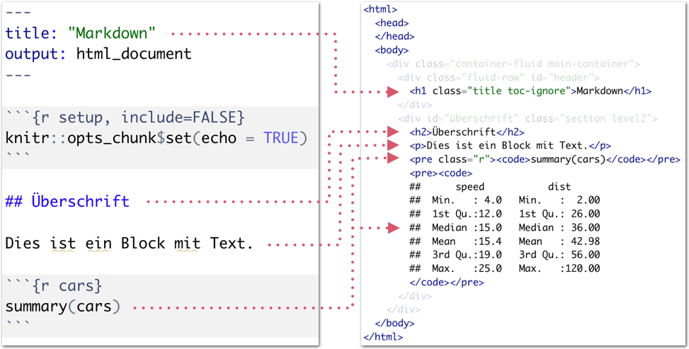
</p>

]

---

# Rendern

.pull-left3[

<ul>
  <li class="m1"><span>HTML wird interpretiert von RStudio (oder Browsern) in ein wohl formatiertes Dokument.</span></li>
  <li class="m2"><span><high>Rstudio</high> zeigt ein gerendertes Dokument im Viewer an. </span></li><br>
</ul>

]

.pull-right6[

<br>
<p align = "center">
  
</p>

]

---

# Überschriften

.pull-left3[

<ul>
  <li class="m1"><span>Überschriften verschiedener <high>Ebenen</high> werden durch verschieden viele <mono>#</mono> ausgedrückt.</span></li>
</ul>

<table style="cellspacing:0; cellpadding:0; border:none; padding-top:20px" width=100%>
  <col width="40%">
  <col width="60%">
<tr>
  <td bgcolor="white">
    <b>Markdown</b>
  </td>
  <td bgcolor="white">
    <b>Beschreibung</b>
  </td> 
</tr>
<tr>
  <td bgcolor="white">
  <mono># text</mono>
  </td>
  <td bgcolor="white">
  Ebene 1
  </td> 
</tr>
<tr>
  <td bgcolor="white">
  <mono>## text</mono>
  </td>
  <td bgcolor="white">
  Ebene 2
  </td> 
</tr>
<tr>
  <td bgcolor="white">
  <mono>...</mono>
  </td>
  <td bgcolor="white">
  ...
  </td> 
</tr>
<tr>
  <td bgcolor="white">
  <mono>##### txt</mono>
  </td>
  <td bgcolor="white">
  Ebene 5
  </td> 
</tr>
</table>

]

.pull-right6[

<br>
<p align = "center">
  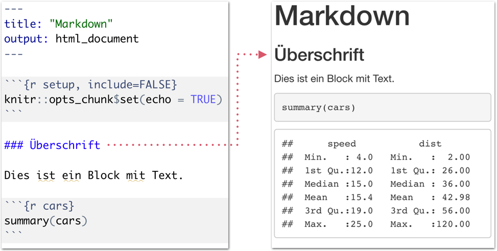
</p>

]

---

# Überschriften

.pull-left3[

<ul>
  <li class="m1"><span>Überschriften verschiedener <high>Ebenen</high> werden durch verschieden viele <mono>#</mono> ausgedrückt.</span></li>
</ul>

<table style="cellspacing:0; cellpadding:0; border:none; padding-top:20px" width=100%>
  <col width="40%">
  <col width="60%">
<tr>
  <td bgcolor="white">
    <b>Markdown</b>
  </td>
  <td bgcolor="white">
    <b>Beschreibung</b>
  </td> 
</tr>
<tr>
  <td bgcolor="white">
  <mono># text</mono>
  </td>
  <td bgcolor="white">
  Ebene 1
  </td> 
</tr>
<tr>
  <td bgcolor="white">
  <mono>## text</mono>
  </td>
  <td bgcolor="white">
  Ebene 2
  </td> 
</tr>
<tr>
  <td bgcolor="white">
  <mono>...</mono>
  </td>
  <td bgcolor="white">
  ...
  </td> 
</tr>
<tr>
  <td bgcolor="white">
  <mono>##### txt</mono>
  </td>
  <td bgcolor="white">
  Ebene 5
  </td> 
</tr>
</table>

]

.pull-right6[

<br>
<p align = "center">
  
</p>

]

---

# Hervorhebung

.pull-left3[

<ul>
  <li class="m1"><span>Verschiedene Zeichen erlauben <high>text- und code-bezogene</high> Hervorhebungen.</span></li>
</ul>

<table style="cellspacing:0; cellpadding:0; border:none; padding-top:20px" width=100%>
  <col width="50%">
  <col width="50%">
<tr>
  <td bgcolor="white">
    <b>Markdown</b>
  </td>
  <td bgcolor="white">
    <b>Beschreibung</b>
  </td> 
</tr>
<tr>
  <td bgcolor="white">
  &ast;<mono>text</mono>&ast;
  </td>
  <td bgcolor="white">
  Kursiv
  </td> 
</tr>
<tr>
  <td bgcolor="white">
  &ast;&ast;<mono>text</mono>&ast;&ast;
  </td>
  <td bgcolor="white">
  Fett
  </td> 
</tr>
<tr>
  <td bgcolor="white">
  &ast;&ast;&ast;<mono>text</mono>&ast;&ast;&ast;
  </td>
  <td bgcolor="white">
  Kursiv und Fett 
  </td> 
</tr>
<tr>
  <td bgcolor="white">
  &grave;<mono>text</mono>&grave;
  </td>
  <td bgcolor="white">
  Code
  </td> 
</tr>
<tr>
  <td bgcolor="white">
  &grave;<mono>r "text"</mono>&grave;
  </td>
  <td bgcolor="white">
  inline Code
  </td> 
</tr>
</table>

]

.pull-right6[

<br>
<p align = "center">
  
</p>

]

---

# Hervorhebung

.pull-left3[

<ul>
  <li class="m1"><span>Verschiedene Zeichen erlauben <high>text- und code-bezogene</high> Hervorhebungen.</span></li>
</ul>

<table style="cellspacing:0; cellpadding:0; border:none; padding-top:20px" width=100%>
  <col width="50%">
  <col width="50%">
<tr>
  <td bgcolor="white">
    <b>Markdown</b>
  </td>
  <td bgcolor="white">
    <b>Beschreibung</b>
  </td> 
</tr>
<tr>
  <td bgcolor="white">
  &ast;<mono>text</mono>&ast;
  </td>
  <td bgcolor="white">
  Kursiv
  </td> 
</tr>
<tr>
  <td bgcolor="white">
  &ast;&ast;<mono>text</mono>&ast;&ast;
  </td>
  <td bgcolor="white">
  Fett
  </td> 
</tr>
<tr>
  <td bgcolor="white">
  &ast;&ast;&ast;<mono>text</mono>&ast;&ast;&ast;
  </td>
  <td bgcolor="white">
  Kursiv und Fett 
  </td> 
</tr>
<tr>
  <td bgcolor="white">
  &grave;<mono>text</mono>&grave;
  </td>
  <td bgcolor="white">
  Code
  </td> 
</tr>
<tr>
  <td bgcolor="white">
  &grave;<mono>r "text"</mono>&grave;
  </td>
  <td bgcolor="white">
  inline Code
  </td> 
</tr>
</table>

]

.pull-right6[

<br>
<p align = "center">
  
</p>

]


---

# Hervorhebung

.pull-left3[

<ul>
  <li class="m1"><span>Verschiedene Zeichen erlauben <high>text- und code-bezogene</high> Hervorhebungen.</span></li>
</ul>

<table style="cellspacing:0; cellpadding:0; border:none; padding-top:20px" width=100%>
  <col width="50%">
  <col width="50%">
<tr>
  <td bgcolor="white">
    <b>Markdown</b>
  </td>
  <td bgcolor="white">
    <b>Beschreibung</b>
  </td> 
</tr>
<tr>
  <td bgcolor="white">
  &ast;<mono>text</mono>&ast;
  </td>
  <td bgcolor="white">
  Kursiv
  </td> 
</tr>
<tr>
  <td bgcolor="white">
  &ast;&ast;<mono>text</mono>&ast;&ast;
  </td>
  <td bgcolor="white">
  Fett
  </td> 
</tr>
<tr>
  <td bgcolor="white">
  &ast;&ast;&ast;<mono>text</mono>&ast;&ast;&ast;
  </td>
  <td bgcolor="white">
  Kursiv und Fett 
  </td> 
</tr>
<tr>
  <td bgcolor="white">
  &grave;<mono>text</mono>&grave;
  </td>
  <td bgcolor="white">
  Code
  </td> 
</tr>
<tr>
  <td bgcolor="white">
  &grave;<mono>r "text"</mono>&grave;
  </td>
  <td bgcolor="white">
  inline Code
  </td> 
</tr>
</table>

]


.pull-right6[

<br>
<p align = "center">
  
</p>

]


---

# Inline Code

.pull-left3[

<ul>
  <li class="m1"><span><high>Zahlen und Wörter</high> im Text können durch inline Code parametrisiert werden.</span></li>
  <li class="m2"><span>inline Code kann, wie <high>Code <mono>chunks</mono></high>, beliebigen R Code enthalten.</span></li>
</ul>

]

.pull-right6[

<br>
<p align = "center">
  
</p>

]

---

# Chunks

.pull-left3[

<ul>
  <li class="m1"><span>Ein <high>code <mono>chunk</mono></high> enthält beliebigen R Code.</span></li>
  <li class="m2"><span>Code chunks werden mit <high>zusätzlichen Argumenten</high> definiert.</span></li>
</ul>

]

.pull-right6[

<br>
<p align = "center">
  
</p>

]

---

# Chunks

.pull-left3[

<table style="cellspacing:0; cellpadding:0; border:none; padding-top:60px" width=100%>
  <col width="60%">
  <col width="40%">
<tr>
  <td bgcolor="white">
    <b>Argument</b>
  </td>
  <td bgcolor="white">
    <b>Beschreibung</b>
  </td> 
</tr>
<tr>
  <td bgcolor="white">
  <mono>echo=T/F</mono>
  </td>
  <td bgcolor="white">
  Zeige/Verstecke <high>Code</high>
  </td> 
</tr>
<tr>
  <td bgcolor="white">
  <mono>eval=T/F</mono>
  </td>
  <td bgcolor="white">
  <high>Code</high> ausführen/nicht-ausf.
  </td> 
</tr>
<tr>
  <td bgcolor="white">
  <mono>include=T/F</mono>
  </td>
  <td bgcolor="white">
  Inkludiere/exkludiere <high>allen Output</high> 
  </td> 
</tr>
<tr>
  <td bgcolor="white">
  <mono>message=T/F</mono>
  </td>
  <td bgcolor="white">
  Inkludiere/exkludiere <highm>messages</highm> im Output
  </td> 
</tr>
<tr>
  <td bgcolor="white">
  <mono>warning=T/F</mono>
  </td>
  <td bgcolor="white">
  Inkludiere/exkludiere <highm>warnings</highm> im Output
  </td> 
</tr>
</table>

<p align="center" style="font-size:12px;padding-top:10px"><mono>T/F = TRUE/FALSE</mono></p>

]

.pull-right6[

<br>
<p align = "center">
  
</p>

]


---

# Chunks

.pull-left3[

<table style="cellspacing:0; cellpadding:0; border:none; padding-top:60px" width=100%>
  <col width="60%">
  <col width="40%">
<tr>
  <td bgcolor="white">
    <b>Argument</b>
  </td>
  <td bgcolor="white">
    <b>Beschreibung</b>
  </td> 
</tr>
<tr>
  <td bgcolor="white">
  <mono>echo=T/F</mono>
  </td>
  <td bgcolor="white">
  Zeige/Verstecke <high>Code</high>
  </td> 
</tr>
<tr>
  <td bgcolor="white">
  <mono>eval=T/F</mono>
  </td>
  <td bgcolor="white">
  <high>Code</high> ausführen/nicht-ausf.
  </td> 
</tr>
<tr>
  <td bgcolor="white">
  <mono>include=T/F</mono>
  </td>
  <td bgcolor="white">
  Inkludiere/exkludiere <high>allen Output</high> 
  </td> 
</tr>
<tr>
  <td bgcolor="white">
  <mono>message=T/F</mono>
  </td>
  <td bgcolor="white">
  Inkludiere/exkludiere <highm>messages</highm> im Output
  </td> 
</tr>
<tr>
  <td bgcolor="white">
  <mono>warning=T/F</mono>
  </td>
  <td bgcolor="white">
  Inkludiere/exkludiere <highm>warnings</highm> im Output
  </td> 
</tr>
</table>

<p align="center" style="font-size:12px;padding-top:10px"><mono>T/F = TRUE/FALSE</mono></p>

]

.pull-right6[

<br>
<p align = "center">
  
</p>

]


---

# Chunks

.pull-left3[

<table style="cellspacing:0; cellpadding:0; border:none; padding-top:60px" width=100%>
  <col width="60%">
  <col width="40%">
<tr>
  <td bgcolor="white">
    <b>Argument</b>
  </td>
  <td bgcolor="white">
    <b>Beschreibung</b>
  </td> 
</tr>
<tr>
  <td bgcolor="white">
  <mono>echo=T/F</mono>
  </td>
  <td bgcolor="white">
  Zeige/Verstecke <high>Code</high>
  </td> 
</tr>
<tr>
  <td bgcolor="white">
  <mono>eval=T/F</mono>
  </td>
  <td bgcolor="white">
  <high>Code</high> ausführen/nicht-ausf.
  </td> 
</tr>
<tr>
  <td bgcolor="white">
  <mono>include=T/F</mono>
  </td>
  <td bgcolor="white">
  Inkludiere/exkludiere <high>allen Output</high> 
  </td> 
</tr>
<tr>
  <td bgcolor="white">
  <mono>message=T/F</mono>
  </td>
  <td bgcolor="white">
  Inkludiere/exkludiere <highm>messages</highm> im Output
  </td> 
</tr>
<tr>
  <td bgcolor="white">
  <mono>warning=T/F</mono>
  </td>
  <td bgcolor="white">
  Inkludiere/exkludiere <highm>warnings</highm> im Output
  </td> 
</tr>
</table>

<p align="center" style="font-size:12px;padding-top:10px"><mono>T/F = TRUE/FALSE</mono></p>

]

.pull-right6[

<br>
<p align = "center">
  
</p>

]

---

# Setup-Chunk

.pull-left3[

<ul>
  <li class="m1"><span>Im Setup-Chunk können <high>Settings für alle Chunks</high> vorgenommen werden.</span></li>
  <li class="m2"><span>Weiterführende Funktionen verfügbar.</span></li>
</ul>

]

.pull-right6[

<br>
<p align = "center">
  
</p>

]

---

# Setup-Chunk

.pull-left3[

<ul>
  <li class="m1"><span>Im Setup-Chunk können <high>Settings für alle Chunks</high> vorgenommen werden.</span></li>
  <li class="m2"><span>Weiterführende Funktionen verfügbar.</span></li>
</ul>

]

.pull-right6[

<br>
<p align = "center">
  
</p>

]


---

# Setup-Chunk

.pull-left3[

<ul>
  <li class="m1"><span>Im Setup-Chunk können <high>Settings für alle Chunks</high> vorgenommen werden.</span></li>
  <li class="m2"><span>Weiterführende Funktionen verfügbar.</span></li>
</ul>

]

.pull-right6[


<p align = "center">
  
</p>

]


---

# Setup-Chunk

.pull-left3[

<ul>
  <li class="m1"><span>Im Setup-Chunk können <high>Settings für alle Chunks</high> vorgenommen werden.</span></li>
  <li class="m2"><span>Weiterführende Funktionen verfügbar.</span></li>
</ul>

]

.pull-right6[


<p align = "center">
  
</p>

]


---

# Setup-Chunk

.pull-left3[

<ul>
  <li class="m1"><span>Im Setup-Chunk können <high>Settings für alle Chunks</high> vorgenommen werden.</span></li>
  <li class="m2"><span>Weiterführende Funktionen verfügbar.</span></li>
</ul>

]

.pull-right6[

<p align = "center">
  
</p>

]


---

# Relativer Pfad

.pull-left35[

<ul>
  <li class="m1"><span>Markdown Dokumente greifen nicht auf das übliche <high>working directory</high> zu.</span></li><br>
  <li class="m2"><span>Pfade in RMarkdown müssen <high>relativ zur Position der .Rmd</high> Datei definiert werden.</span></li>
</ul>

<br>
```R
# Lese Daten
read_csv("../1_Data/daten.csv")

# Lese CSS (mehr dazu später)
css: "../2_Assets/styling.csv")
```

]

.pull-right55[
<br>
<p align = "center">
  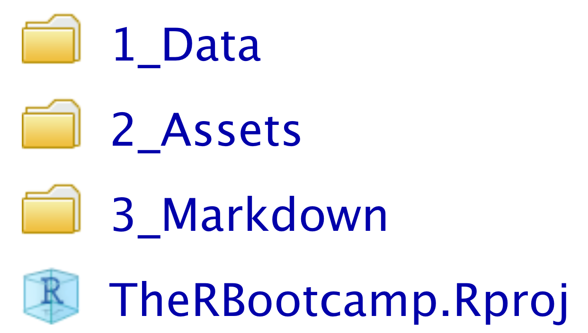
</p>

]


---

.pull-left4[

# Grafiken skalieren

<ul>
  <li class="m1"><span>Die <high>Darstellung</high> von Grafiken kann in den <mono>Chunk</mono>-Settings angepasst werden.</span></li> 
  <li class="m2"><span>Die Argumente beginnen (meist) mit <highm>fig.*</highm>.</span></li> 
</ul>

<table style="cellspacing:0; cellpadding:0; border:none; padding-top:10px" width=100%>
  <col width="40%">
  <col width="60%">
<tr>
  <td bgcolor="white">
    <b>Argument</b>
  </td>
  <td bgcolor="white">
    <b>Beschreibung</b>
  </td> 
</tr>
<tr>
  <td bgcolor="white">
  <mono>fig.width</mono>, <mono>fig.height</mono>
  </td>
  <td bgcolor="white">
  <high>Breite</high> und <high>Höhe</high> in inches.
  </td> 
</tr>
<tr>
  <td bgcolor="white">
  <mono>fig.asp</mono>
  </td>
  <td bgcolor="white">
   <high>Seitenverhältnis</high>: Höhe relativ zur Breite.   
  </td> 
</tr>
<tr>
  <td bgcolor="white">
  <mono>fig.align</mono>
  </td>
  <td bgcolor="white">
  <high>Position</high> der Abbildung: <mono>'center'</mono>, <mono>'left'</mono>, <mono>'right'</mono>.
  </td> 
</tr>
<tr>
  <td bgcolor="white">
  <mono>dpi</mono> 
  </td>
  <td bgcolor="white">
  <high>Auflösung</high> der Abbildung (dots per inch).
  </td> 
</tr>
</table>
]

.pull-right5[
<br>
<p align = "center">
  
</p>

]

---

.pull-left4[

# Grafiken skalieren

<ul>
  <li class="m1"><span>Die <high>Darstellung</high> von Grafiken kann in den <mono>Chunk</mono>-Settings angepasst werden.</span></li> 
  <li class="m2"><span>Die Argumente beginnen (meist) mit <highm>fig.*</highm>.</span></li> 
</ul>

<table style="cellspacing:0; cellpadding:0; border:none; padding-top:10px" width=100%>
  <col width="40%">
  <col width="60%">
<tr>
  <td bgcolor="white">
    <b>Argument</b>
  </td>
  <td bgcolor="white">
    <b>Beschreibung</b>
  </td> 
</tr>
<tr>
  <td bgcolor="white">
  <mono>fig.width</mono>, <mono>fig.height</mono>
  </td>
  <td bgcolor="white">
  <high>Breite</high> und <high>Höhe</high> in inches.
  </td> 
</tr>
<tr>
  <td bgcolor="white">
  <mono>fig.asp</mono>
  </td>
  <td bgcolor="white">
   <high>Seitenverhältnis</high>: Höhe relativ zur Breite.   
  </td> 
</tr>
<tr>
  <td bgcolor="white">
  <mono>fig.align</mono>
  </td>
  <td bgcolor="white">
  <high>Position</high> der Abbildung: <mono>'center'</mono>, <mono>'left'</mono>, <mono>'right'</mono>.
  </td> 
</tr>
<tr>
  <td bgcolor="white">
  <mono>dpi</mono> 
  </td>
  <td bgcolor="white">
  <high>Auflösung</high> der Abbildung (dots per inch).
  </td> 
</tr>
</table>
]

.pull-right5[
<br>
<p align = "center">
  
</p>

]

---

.pull-left4[

# Grafiken skalieren

<ul>
  <li class="m1"><span>Die <high>Darstellung</high> von Grafiken kann in den <mono>Chunk</mono>-Settings angepasst werden.</span></li> 
  <li class="m2"><span>Die Argumente beginnen (meist) mit <highm>fig.*</highm>.</span></li> 
</ul>

<table style="cellspacing:0; cellpadding:0; border:none; padding-top:10px" width=100%>
  <col width="40%">
  <col width="60%">
<tr>
  <td bgcolor="white">
    <b>Argument</b>
  </td>
  <td bgcolor="white">
    <b>Beschreibung</b>
  </td> 
</tr>
<tr>
  <td bgcolor="white">
  <mono>fig.width</mono>, <mono>fig.height</mono>
  </td>
  <td bgcolor="white">
  <high>Breite</high> und <high>Höhe</high> in inches.
  </td> 
</tr>
<tr>
  <td bgcolor="white">
  <mono>fig.asp</mono>
  </td>
  <td bgcolor="white">
   <high>Seitenverhältnis</high>: Höhe relativ zur Breite.   
  </td> 
</tr>
<tr>
  <td bgcolor="white">
  <mono>fig.align</mono>
  </td>
  <td bgcolor="white">
  <high>Position</high> der Abbildung: <mono>'center'</mono>, <mono>'left'</mono>, <mono>'right'</mono>.
  </td> 
</tr>
<tr>
  <td bgcolor="white">
  <mono>dpi</mono> 
  </td>
  <td bgcolor="white">
  <high>Auflösung</high> der Abbildung (dots per inch).
  </td> 
</tr>
</table>
]

.pull-right5[
<br>
<p align = "center">
  
</p>

]

---

.pull-left4[

# Grafiken skalieren

<ul>
  <li class="m1"><span>Die <high>Darstellung</high> von Grafiken kann in den <mono>Chunk</mono>-Settings angepasst werden.</span></li> 
  <li class="m2"><span>Die Argumente beginnen (meist) mit <highm>fig.*</highm>.</span></li> 
</ul>

<table style="cellspacing:0; cellpadding:0; border:none; padding-top:10px" width=100%>
  <col width="40%">
  <col width="60%">
<tr>
  <td bgcolor="white">
    <b>Argument</b>
  </td>
  <td bgcolor="white">
    <b>Beschreibung</b>
  </td> 
</tr>
<tr>
  <td bgcolor="white">
  <mono>fig.width</mono>, <mono>fig.height</mono>
  </td>
  <td bgcolor="white">
  <high>Breite</high> und <high>Höhe</high> in inches.
  </td> 
</tr>
<tr>
  <td bgcolor="white">
  <mono>fig.asp</mono>
  </td>
  <td bgcolor="white">
   <high>Seitenverhältnis</high>: Höhe relativ zur Breite.   
  </td> 
</tr>
<tr>
  <td bgcolor="white">
  <mono>fig.align</mono>
  </td>
  <td bgcolor="white">
  <high>Position</high> der Abbildung: <mono>'center'</mono>, <mono>'left'</mono>, <mono>'right'</mono>.
  </td> 
</tr>
<tr>
  <td bgcolor="white">
  <mono>dpi</mono> 
  </td>
  <td bgcolor="white">
  <high>Auflösung</high> der Abbildung (dots per inch).
  </td> 
</tr>
</table>
]

.pull-right5[
<br>
<p align = "center">
  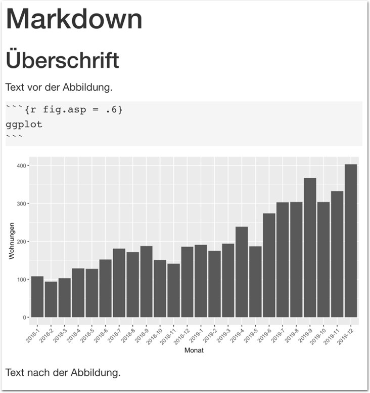
</p>

]

---

.pull-left4[

# Grafiken skalieren

<ul>
  <li class="m1"><span>Die <high>Darstellung</high> von Grafiken kann in den <mono>Chunk</mono>-Settings angepasst werden.</span></li> 
  <li class="m2"><span>Die Argumente beginnen (meist) mit <highm>fig.*</highm>.</span></li> 
</ul>

<table style="cellspacing:0; cellpadding:0; border:none; padding-top:10px" width=100%>
  <col width="40%">
  <col width="60%">
<tr>
  <td bgcolor="white">
    <b>Argument</b>
  </td>
  <td bgcolor="white">
    <b>Beschreibung</b>
  </td> 
</tr>
<tr>
  <td bgcolor="white">
  <mono>fig.width</mono>, <mono>fig.height</mono>
  </td>
  <td bgcolor="white">
  <high>Breite</high> und <high>Höhe</high> in inches.
  </td> 
</tr>
<tr>
  <td bgcolor="white">
  <mono>fig.asp</mono>
  </td>
  <td bgcolor="white">
   <high>Seitenverhältnis</high>: Höhe relativ zur Breite.   
  </td> 
</tr>
<tr>
  <td bgcolor="white">
  <mono>fig.align</mono>
  </td>
  <td bgcolor="white">
  <high>Position</high> der Abbildung: <mono>'center'</mono>, <mono>'left'</mono>, <mono>'right'</mono>.
  </td> 
</tr>
<tr>
  <td bgcolor="white">
  <mono>dpi</mono> 
  </td>
  <td bgcolor="white">
  <high>Auflösung</high> der Abbildung (dots per inch).
  </td> 
</tr>
</table>
]

.pull-right5[
<br>
<p align = "center">
  
</p>

]


---

.pull-left4[

# Bildunterschrift

<ul>
  <li class="m1"><span>Bildunterschriften können durch <highm>fig.cap</highm> gesetzt.</span></li> 
  <li class="m2"><span>Der Text kann <high>innerhalb des Chunks</high> definiert werden.</span></li> 
</ul>


]

.pull-right5[
<br>
<p align = "center">
  
</p>

]


---

.pull-left4[

# Deskriptive Tabellen

<ul>
  <li class="m1"><span>Mit <mono>knitr</mono> und <mono>kableExtra</mono> können <high><mono>tibbles</mono> als Tabellen</high> inkludiert werden.</span></li> 
</ul>

<table style="cellspacing:0; cellpadding:0; border:none; padding-top:10px" width=100%>
  <col width="40%">
  <col width="60%">
<tr>
  <td bgcolor="white">
    <b>Argument</b>
  </td>
  <td bgcolor="white">
    <b>Beschreibung</b>
  </td> 
</tr>
<tr>
  <td bgcolor="white">
  <mono>format</mono>
  </td>
  <td bgcolor="white"><high>Ausgabeformat</high>: 
  <mono>"html"</mon>, <mono>"latex"</mono>
  </td> 
</tr>
<tr>
  <td bgcolor="white">
  <mono>digit</mono>
  </td>
  <td bgcolor="white">
   Anzahl <high>Nachkommastellen</high>.   
  </td> 
</tr>
<tr>
  <td bgcolor="white">
  <mono>col.names</mono>
  </td>
  <td bgcolor="white">
  <high>Spaltennamen</high>.
  </td> 
</tr>
<tr>
  <td bgcolor="white">
  <mono>escape</mono> 
  </td>
  <td bgcolor="white">
  Spaltennamen <high>nicht</high> als HTML <high>interpretieren</high>.
  </td> 
</tr>
<tr>
  <td bgcolor="white">
  <mono>align</mono> 
  </td>
  <td bgcolor="white">
  <high>Ausrichtung</high> der Spalten: <mono><b>l</b>eft</mono>, <mono><b>c</b>enter</mono>, <mono><b>r</b>ight</mono>.
  </td> 
</tr>
<tr>
  <td bgcolor="white">
  <mono>caption</mono> 
  </td>
  <td bgcolor="white">
  <high>Tabellenüberschrift</high>. 
  </td> 
</tr>
</table>


]

.pull-right5[
<br>
<p align = "center">
  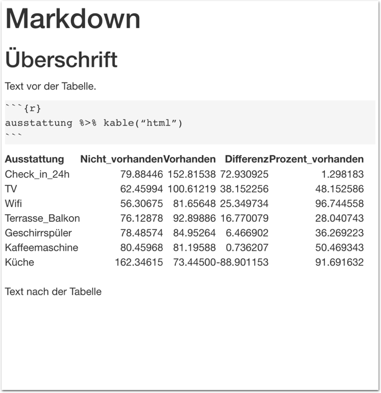
</p>

]

---

.pull-left4[

# Deskriptive Tabellen

<ul>
  <li class="m1"><span>Mit <mono>knitr</mono> und <mono>kableExtra</mono> können <high><mono>tibbles</mono> als Tabellen</high> inkludiert werden.</span></li> 
</ul>

<table style="cellspacing:0; cellpadding:0; border:none; padding-top:10px" width=100%>
  <col width="40%">
  <col width="60%">
<tr>
  <td bgcolor="white">
    <b>Argument</b>
  </td>
  <td bgcolor="white">
    <b>Beschreibung</b>
  </td> 
</tr>
<tr>
  <td bgcolor="white">
  <mono>format</mono>
  </td>
  <td bgcolor="white"><high>Ausgabeformat</high>: 
  <mono>"html"</mon>, <mono>"latex"</mono>
  </td> 
</tr>
<tr>
  <td bgcolor="white">
  <mono>digit</mono>
  </td>
  <td bgcolor="white">
   Anzahl <high>Nachkommastellen</high>.   
  </td> 
</tr>
<tr>
  <td bgcolor="white">
  <mono>col.names</mono>
  </td>
  <td bgcolor="white">
  <high>Spaltennamen</high>.
  </td> 
</tr>
<tr>
  <td bgcolor="white">
  <mono>escape</mono> 
  </td>
  <td bgcolor="white">
  Spaltennamen <high>nicht</high> als HTML <high>interpretieren</high>.
  </td> 
</tr>
<tr>
  <td bgcolor="white">
  <mono>align</mono> 
  </td>
  <td bgcolor="white">
  <high>Ausrichtung</high> der Spalten: <mono><b>l</b>eft</mono>, <mono><b>c</b>enter</mono>, <mono><b>r</b>ight</mono>.
  </td> 
</tr>
<tr>
  <td bgcolor="white">
  <mono>caption</mono> 
  </td>
  <td bgcolor="white">
  <high>Tabellenüberschrift</high>. 
  </td> 
</tr>
</table>


]

.pull-right5[
<br>
<p align = "center">
  
</p>

]

---

.pull-left4[

# Deskriptive Tabellen

<ul>
  <li class="m1"><span>Mit <mono>knitr</mono> und <mono>kableExtra</mono> können <high><mono>tibbles</mono> als Tabellen</high> inkludiert werden.</span></li> 
</ul>

<table style="cellspacing:0; cellpadding:0; border:none; padding-top:10px" width=100%>
  <col width="40%">
  <col width="60%">
<tr>
  <td bgcolor="white">
    <b>Argument</b>
  </td>
  <td bgcolor="white">
    <b>Beschreibung</b>
  </td> 
</tr>
<tr>
  <td bgcolor="white">
  <mono>format</mono>
  </td>
  <td bgcolor="white"><high>Ausgabeformat</high>: 
  <mono>"html"</mon>, <mono>"latex"</mono>
  </td> 
</tr>
<tr>
  <td bgcolor="white">
  <mono>digit</mono>
  </td>
  <td bgcolor="white">
   Anzahl <high>Nachkommastellen</high>.   
  </td> 
</tr>
<tr>
  <td bgcolor="white">
  <mono>col.names</mono>
  </td>
  <td bgcolor="white">
  <high>Spaltennamen</high>.
  </td> 
</tr>
<tr>
  <td bgcolor="white">
  <mono>escape</mono> 
  </td>
  <td bgcolor="white">
  Spaltennamen <high>nicht</high> als HTML <high>interpretieren</high>.
  </td> 
</tr>
<tr>
  <td bgcolor="white">
  <mono>align</mono> 
  </td>
  <td bgcolor="white">
  <high>Ausrichtung</high> der Spalten: <mono><b>l</b>eft</mono>, <mono><b>c</b>enter</mono>, <mono><b>r</b>ight</mono>.
  </td> 
</tr>
<tr>
  <td bgcolor="white">
  <mono>caption</mono> 
  </td>
  <td bgcolor="white">
  <high>Tabellenüberschrift</high>. 
  </td> 
</tr>
</table>


]

.pull-right5[
<br>
<p align = "center">
  
</p>

]

---

.pull-left4[

# Deskriptive Tabellen

<ul>
  <li class="m1"><span>Mit <mono>knitr</mono> und <mono>kableExtra</mono> können <high><mono>tibbles</mono> als Tabellen</high> inkludiert werden.</span></li> 
</ul>

<table style="cellspacing:0; cellpadding:0; border:none; padding-top:10px" width=100%>
  <col width="40%">
  <col width="60%">
<tr>
  <td bgcolor="white">
    <b>Argument</b>
  </td>
  <td bgcolor="white">
    <b>Beschreibung</b>
  </td> 
</tr>
<tr>
  <td bgcolor="white">
  <mono>format</mono>
  </td>
  <td bgcolor="white"><high>Ausgabeformat</high>: 
  <mono>"html"</mon>, <mono>"latex"</mono>
  </td> 
</tr>
<tr>
  <td bgcolor="white">
  <mono>digit</mono>
  </td>
  <td bgcolor="white">
   Anzahl <high>Nachkommastellen</high>.   
  </td> 
</tr>
<tr>
  <td bgcolor="white">
  <mono>col.names</mono>
  </td>
  <td bgcolor="white">
  <high>Spaltennamen</high>.
  </td> 
</tr>
<tr>
  <td bgcolor="white">
  <mono>escape</mono> 
  </td>
  <td bgcolor="white">
  Spaltennamen <high>nicht</high> als HTML <high>interpretieren</high>.
  </td> 
</tr>
<tr>
  <td bgcolor="white">
  <mono>align</mono> 
  </td>
  <td bgcolor="white">
  <high>Ausrichtung</high> der Spalten: <mono><b>l</b>eft</mono>, <mono><b>c</b>enter</mono>, <mono><b>r</b>ight</mono>.
  </td> 
</tr>
<tr>
  <td bgcolor="white">
  <mono>caption</mono> 
  </td>
  <td bgcolor="white">
  <high>Tabellenüberschrift</high>. 
  </td> 
</tr>
</table>


]

.pull-right5[
<br>
<p align = "center">
  
</p>

]

---

.pull-left4[

# Deskriptive Tabellen

<ul>
  <li class="m1"><span>Mit <mono>knitr</mono> und <mono>kableExtra</mono> können <high><mono>tibbles</mono> als Tabellen</high> inkludiert werden.</span></li> 
</ul>

<table style="cellspacing:0; cellpadding:0; border:none; padding-top:10px" width=100%>
  <col width="40%">
  <col width="60%">
<tr>
  <td bgcolor="white">
    <b>Argument</b>
  </td>
  <td bgcolor="white">
    <b>Beschreibung</b>
  </td> 
</tr>
<tr>
  <td bgcolor="white">
  <mono>format</mono>
  </td>
  <td bgcolor="white"><high>Ausgabeformat</high>: 
  <mono>"html"</mon>, <mono>"latex"</mono>
  </td> 
</tr>
<tr>
  <td bgcolor="white">
  <mono>digit</mono>
  </td>
  <td bgcolor="white">
   Anzahl <high>Nachkommastellen</high>.   
  </td> 
</tr>
<tr>
  <td bgcolor="white">
  <mono>col.names</mono>
  </td>
  <td bgcolor="white">
  <high>Spaltennamen</high>.
  </td> 
</tr>
<tr>
  <td bgcolor="white">
  <mono>escape</mono> 
  </td>
  <td bgcolor="white">
  Spaltennamen <high>nicht</high> als HTML <high>interpretieren</high>.
  </td> 
</tr>
<tr>
  <td bgcolor="white">
  <mono>align</mono> 
  </td>
  <td bgcolor="white">
  <high>Ausrichtung</high> der Spalten: <mono><b>l</b>eft</mono>, <mono><b>c</b>enter</mono>, <mono><b>r</b>ight</mono>.
  </td> 
</tr>
<tr>
  <td bgcolor="white">
  <mono>caption</mono> 
  </td>
  <td bgcolor="white">
  <high>Tabellenüberschrift</high>. 
  </td> 
</tr>
</table>


]

.pull-right5[
<br>
<p align = "center">
  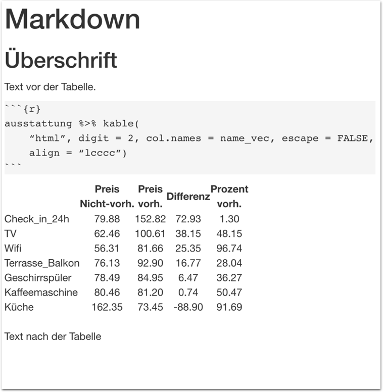
</p>

]

---

.pull-left4[

# Deskriptive Tabellen

<ul>
  <li class="m1"><span>Mit <mono>knitr</mono> und <mono>kableExtra</mono> können <high><mono>tibbles</mono> als Tabellen</high> inkludiert werden.</span></li> 
</ul>

<table style="cellspacing:0; cellpadding:0; border:none; padding-top:10px" width=100%>
  <col width="40%">
  <col width="60%">
<tr>
  <td bgcolor="white">
    <b>Argument</b>
  </td>
  <td bgcolor="white">
    <b>Beschreibung</b>
  </td> 
</tr>
<tr>
  <td bgcolor="white">
  <mono>column_spec</mono>
  </td>
  <td bgcolor="white">
  Formatierungder <high>Spalten</high>, e.g., <mono>width</mono>.
  </td> 
</tr>
<tr>
  <td bgcolor="white">
  <mono>cell_spec</mono>
  </td>
  <td bgcolor="white">
  Formatierung der <high>Zellen</high>, e.g., <mono>bold</mono> und <mono>font_size</mono>.
  </td> 
</tr>
<tr>
  <td bgcolor="white">
  <mono>spec_font_size</mono>
  </td>
  <td bgcolor="white">
  <high>Helferfunktion</high> für <mono>font_size</mono>.
  </td> 
</tr>
</table>


]

.pull-right5[
<br>
<p align = "center">
  
</p>

]

---

.pull-left4[

# Deskriptive Tabellen

<ul>
  <li class="m1"><span>Mit <mono>knitr</mono> und <mono>kableExtra</mono> können <high><mono>tibbles</mono> als Tabellen</high> inkludiert werden.</span></li> 
</ul>

<table style="cellspacing:0; cellpadding:0; border:none; padding-top:10px" width=100%>
  <col width="40%">
  <col width="60%">
<tr>
  <td bgcolor="white">
    <b>Argument</b>
  </td>
  <td bgcolor="white">
    <b>Beschreibung</b>
  </td> 
</tr>
<tr>
  <td bgcolor="white">
  <mono>column_spec</mono>
  </td>
  <td bgcolor="white">
  Formatierungder <high>Spalten</high>, e.g., <mono>width</mono>.
  </td> 
</tr>
<tr>
  <td bgcolor="white">
  <mono>cell_spec</mono>
  </td>
  <td bgcolor="white">
  Formatierung der <high>Zellen</high>, e.g., <mono>bold</mono> und <mono>font_size</mono>.
  </td> 
</tr>
<tr>
  <td bgcolor="white">
  <mono>spec_font_size</mono>
  </td>
  <td bgcolor="white">
  <high>Helferfunktion</high> für <mono>font_size</mono>.
  </td> 
</tr>
</table>


]

.pull-right5[
<br>
<p align = "center">
  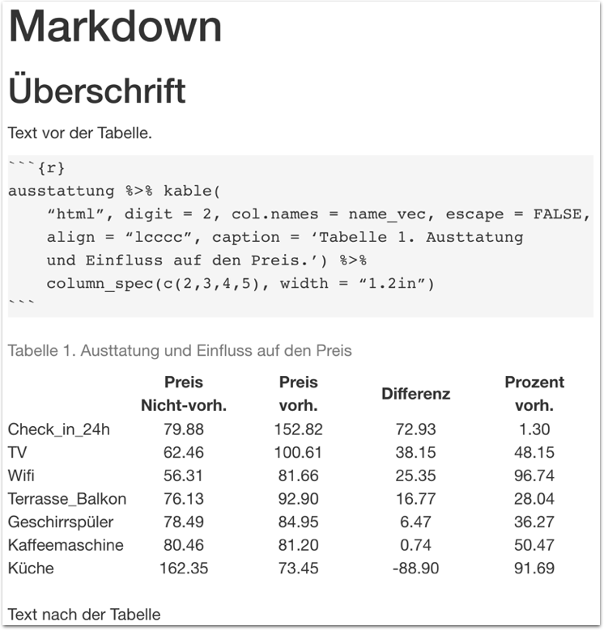
</p>

]

---

.pull-left4[

# Deskriptive Tabellen

<ul>
  <li class="m1"><span>Mit <mono>knitr</mono> und <mono>kableExtra</mono> können <high><mono>tibbles</mono> als Tabellen</high> inkludiert werden.</span></li> 
</ul>

<table style="cellspacing:0; cellpadding:0; border:none; padding-top:10px" width=100%>
  <col width="40%">
  <col width="60%">
<tr>
  <td bgcolor="white">
    <b>Argument</b>
  </td>
  <td bgcolor="white">
    <b>Beschreibung</b>
  </td> 
</tr>
<tr>
  <td bgcolor="white">
  <mono>column_spec</mono>
  </td>
  <td bgcolor="white">
  Formatierungder <high>Spalten</high>, e.g., <mono>width</mono>.
  </td> 
</tr>
<tr>
  <td bgcolor="white">
  <mono>cell_spec</mono>
  </td>
  <td bgcolor="white">
  Formatierung der <high>Zellen</high>, e.g., <mono>bold</mono> und <mono>font_size</mono>.
  </td> 
</tr>
<tr>
  <td bgcolor="white">
  <mono>spec_font_size</mono>
  </td>
  <td bgcolor="white">
  <high>Helferfunktion</high> für <mono>font_size</mono>.
  </td> 
</tr>
</table>


]

.pull-right5[
<br>
<p align = "center">
  
</p>

]
---

.pull-left4[

# Statistische Modelle

<ul>
  <li class="m1"><span>Mit der <mono>tab_model</mono> Funktion des <mono>sjPlot</mono> Pakets lassen sich <high>statistische Modelle</high> als (HTML) Tabellen ausgeben.</span></li>
</ul>

<table style="cellspacing:0; cellpadding:0; border:none; padding-top:10px" width=100%>
  <col width="40%">
  <col width="60%">
<tr>
  <td bgcolor="white">
    <b>Argument</b>
  </td>
  <td bgcolor="white">
    <b>Beschreibung</b>
  </td> 
</tr>
<tr>
  <td bgcolor="white">
  <mono>pred.labels</mono> 
  </td>
  <td bgcolor="white">
  <high>Namen</high> der Prädiktoren anpassen.</td>
</tr>
<tr>
  <td bgcolor="white">
  <mono>title</mono>
  </td>
  <td bgcolor="white">
  Tabellenüberschrift.
  </td> 
</tr>
<tr>
  <td bgcolor="white">
  <mono>show.*</mono>
  </td>
  <td bgcolor="white">
  Bestimme <high>welche Werte</high> dargestellt werden.
  </td> 
</tr>
</table>
]

.pull-right5[
<br>
<p align = "center">
  
</p>

]

---

.pull-left4[

# Statistische Modelle

<ul>
  <li class="m1"><span>Mit der <mono>tab_model</mono> Funktion des <mono>sjPlot</mono> Pakets lassen sich <high>statistische Modelle</high> als (HTML) Tabellen ausgeben.</span>
 </li>
</ul>

<table style="cellspacing:0; cellpadding:0; border:none; padding-top:10px; width=100%">
  <col width="40%">
  <col width="60%">
<tr>
  <td bgcolor="white">
    <b>Argument</b>
  </td>
  <td bgcolor="white">
    <b>Beschreibung</b>
  </td> 
</tr>
<tr>
  <td bgcolor="white">
  <mono>pred.labels</mono> 
  </td>
  <td bgcolor="white">
  <high>Namen</high> der Prädiktoren anpassen.</td>
</tr>
<tr>
  <td bgcolor="white">
  <mono>title</mono>
  </td>
  <td bgcolor="white">
  Tabellenüberschrift.
  </td> 
</tr>
<tr>
  <td bgcolor="white">
  <mono>show.*</mono>
  </td>
  <td bgcolor="white">
  Bestimme <high>welche Werte</high> dargestellt werden.
  </td> 
</tr>
</table>
]

.pull-right5[
<br>
<p align = "center">
  
</p>

]

---

.pull-left4[

# Statistische Modelle

<ul>
  <li class="m1"><span>Mit der <mono>tab_model</mono> Funktion des <mono>sjPlot</mono> Pakets lassen sich <high>statistische Modelle</high> als (HTML) Tabellen ausgeben.</span></li>
</ul>

<table style="cellspacing:0; cellpadding:0; border:none; padding-top:10px; width=100%">
  <col width="40%">
  <col width="60%">
<tr>
  <td bgcolor="white">
    <b>Argument</b>
  </td>
  <td bgcolor="white">
    <b>Beschreibung</b>
  </td> 
</tr>
<tr>
  <td bgcolor="white">
  <mono>pred.labels</mono> 
  </td>
  <td bgcolor="white">
  <high>Namen</high> der Prädiktoren anpassen.</td>
</tr>
<tr>
  <td bgcolor="white">
  <mono>title</mono>
  </td>
  <td bgcolor="white">
  Tabellenüberschrift.
  </td> 
</tr>
<tr>
  <td bgcolor="white">
  <mono>show.*</mono>
  </td>
  <td bgcolor="white">
  Bestimme <high>welche Werte</high> dargestellt werden.
  </td> 
</tr>
</table>
]

.pull-right5[
<br>
<p align = "center">
  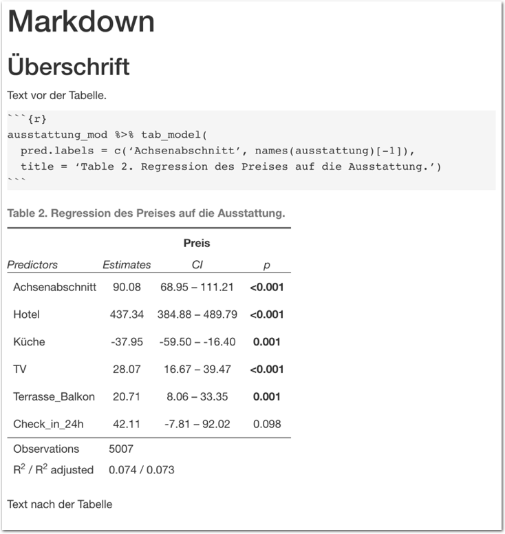
</p>

]

---

.pull-left4[

# Links, Fussnoten

<ul>
  <li class="m1"><span>Zum Einbinden von Links und Fussnoten gibt es ebenfalls spezielle  <high>Markdown Syntax</high>.</span></li>
</ul>

<table style="cellspacing:0; cellpadding:0; border:none; padding-top:10px" width=100%>
  <col width="40%">
  <col width="60%">
<tr>
  <td bgcolor="white">
    <b>Markdown</b>
  </td>
  <td bgcolor="white">
    <b>Beschreibung</b>
  </td> 
</tr>
<tr>
  <td bgcolor="white">
  <mono>&lsqb;Name&rsqb;(URL)</mono>
  </td>
  <td bgcolor="white">
  <high>Link</high>. Name erscheint im Text, URL nicht.
  </td> 
</tr>
<tr>
  <td bgcolor="white">
  <mono>^&lsqb;Text&rsqb;</mono>
  </td>
  <td bgcolor="white">
   <high>Fussnoten</high> werden unten am Text angehängt.    
  </td> 
</tr>
<tr>
  <td bgcolor="white">
  <mono>***</mono>
  </td>
  <td bgcolor="white">
   Fügt eine <high>horizontale</high> Trennlinie ein.
  </td> 
</tr>
</table>

]

.pull-right5[
<br><br>
<p align = "center">
  
</p>

]

---

.pull-left4[

# Quotes

<ul>
  <li class="m1"><span><high>Zitationen</high> (Quotes) werden direkt in Markdown erstellt.</span></li>
</ul>

<table style="cellspacing:0; cellpadding:0; border:none; padding-top:10px" width=100%>
  <col width="40%">
  <col width="60%">
<tr>
  <td bgcolor="white">
    <b>Markdown</b>
  </td>
  <td bgcolor="white">
    <b>Beschreibung</b>
  </td> 
</tr>
<tr>
  <td bgcolor="white">
  <mono>> block quote</mono>
  </td>
  <td bgcolor="white">
  Text wird als <high>Zitat</high> angezeigt.<high></high>
  </td> 
</tr>
<tr>
  <td bgcolor="white">
  <mono></mono> 
  </td>
  <td bgcolor="white">
  </td> 
</tr>
<tr>
  <td bgcolor="white">
  <mono></mono>
  </td>
  <td bgcolor="white">
  </td> 
</tr>
</table>

]

.pull-right5[
<br><br>
<p align = "center">
  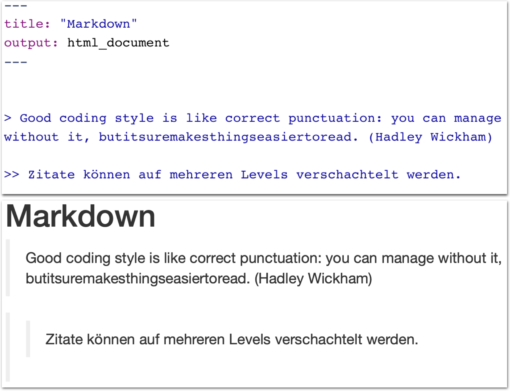
</p>


]

---

.pull-left4[

# Markdown Tabellen

<ul>
 <li class="m1"><span>Um <high>einfache Tabellen</high> zu erstellen ist kein Zusatzpaket notwendig.</span></li> 
</ul>

<table style="cellspacing:0; cellpadding:0; border:none; padding-top:10px" width=100%>
  <col width="40%">
  <col width="60%">
<tr>
  <td bgcolor="white">
    <b>Markdown</b>
  </td>
  <td bgcolor="white">
    <b>Beschreibung</b>
  </td> 
</tr>
<tr>
  <td bgcolor="white">
  <mono>|</mono>
  </td>
  <td bgcolor="white">
  Definition von <high>Spaltentrennung</high>
  </td> 
</tr>
<tr>
  <td bgcolor="white">
  <mono>---</mono>
  </td>
  <td bgcolor="white">
   Definition von <high>horizontalen Linien</high>.    
  </td> 
</tr>
<tr>
  <td bgcolor="white">
  <mono>|:,  |: :|, :|</mono> 
  </td>
  <td bgcolor="white">
  links-bündig, zentriert, rechts-bündig
  </td> 
</tr>
<tr>
  <td bgcolor="white">
  <mono></mono>
  </td>
  <td bgcolor="white">
  </td> 
</tr>
</table>

]

.pull-right5[
<br><br>
<p align = "center">
  
</p>

]

---

.pull-left4[

# Markdown Tabellen

<ul>
 <li class="m1"><span>Um <high>einfache Tabellen</high> zu erstellen ist kein Zusatzpaket notwendig.</span></li> 
</ul>

<table style="cellspacing:0; cellpadding:0; border:none; padding-top:10px" width=100%>
  <col width="40%">
  <col width="60%">
<tr>
  <td bgcolor="white">
    <b>Markdown</b>
  </td>
  <td bgcolor="white">
    <b>Beschreibung</b>
  </td> 
</tr>
<tr>
  <td bgcolor="white">
  <mono>|</mono>
  </td>
  <td bgcolor="white">
  Definition von <high>Spaltentrennung</high>
  </td> 
</tr>
<tr>
  <td bgcolor="white">
  <mono>---</mono>
  </td>
  <td bgcolor="white">
   Definition von <high>horizontalen Linien</high>.    
  </td> 
</tr>
<tr>
  <td bgcolor="white">
  <mono>|:,  |: :|, :|</mono> 
  </td>
  <td bgcolor="white">
  links-bündig, zentriert, rechts-bündig
  </td> 
</tr>
<tr>
  <td bgcolor="white">
  <mono></mono>
  </td>
  <td bgcolor="white">
  </td> 
</tr>
</table>

]

.pull-right5[
<br><br>
<p align = "center">
  
</p>

]

---

.pull-left4[

# Markdown Tabellen

<ul>
 <li class="m1"><span>Um <high>einfache Tabellen</high> zu erstellen ist kein Zusatzpaket notwendig.</span></li> 
</ul>

<table style="cellspacing:0; cellpadding:0; border:none; padding-top:10px" width=100%>
  <col width="40%">
  <col width="60%">
<tr>
  <td bgcolor="white">
    <b>Markdown</b>
  </td>
  <td bgcolor="white">
    <b>Beschreibung</b>
  </td> 
</tr>
<tr>
  <td bgcolor="white">
  <mono>|</mono>
  </td>
  <td bgcolor="white">
  Definition von <high>Spaltentrennung</high>
  </td> 
</tr>
<tr>
  <td bgcolor="white">
  <mono>---</mono>
  </td>
  <td bgcolor="white">
   Definition von <high>horizontalen Linien</high>.    
  </td> 
</tr>
<tr>
  <td bgcolor="white">
  <mono>|:,  |: :|, :|</mono> 
  </td>
  <td bgcolor="white">
  links-bündig, zentriert, rechts-bündig
  </td> 
</tr>
<tr>
  <td bgcolor="white">
  <mono></mono>
  </td>
  <td bgcolor="white">
  </td> 
</tr>
</table>

]

.pull-right5[
<br><br>
<p align = "center">
  
</p>

]

---

.pull-left4[

# Markdown Tabellen

<ul>
 <li class="m1"><span>Um <high>einfache Tabellen</high> zu erstellen ist kein Zusatzpaket notwendig.</span></li> 
</ul>

<table style="cellspacing:0; cellpadding:0; border:none; padding-top:10px" width=100%>
  <col width="40%">
  <col width="60%">
<tr>
  <td bgcolor="white">
    <b>Markdown</b>
  </td>
  <td bgcolor="white">
    <b>Beschreibung</b>
  </td> 
</tr>
<tr>
  <td bgcolor="white">
  <mono>|</mono>
  </td>
  <td bgcolor="white">
  Definition von <high>Spaltentrennung</high>
  </td> 
</tr>
<tr>
  <td bgcolor="white">
  <mono>---</mono>
  </td>
  <td bgcolor="white">
   Definition von <high>horizontalen Linien</high>.    
  </td> 
</tr>
<tr>
  <td bgcolor="white">
  <mono>|:,  |: :|, :|</mono> 
  </td>
  <td bgcolor="white">
  links-bündig, zentriert, rechts-bündig
  </td> 
</tr>
<tr>
  <td bgcolor="white">
  <mono></mono>
  </td>
  <td bgcolor="white">
  </td> 
</tr>
</table>

]

.pull-right5[
<br><br>
<p align = "center">
  
</p>

]

---

.pull-left4[

# Markdown Tabellen

<ul>
 <li class="m1"><span>Um <high>einfache Tabellen</high> zu erstellen ist kein Zusatzpaket notwendig.</span></li> 
</ul>

<table style="cellspacing:0; cellpadding:0; border:none; padding-top:10px" width=100%>
  <col width="40%">
  <col width="60%">
<tr>
  <td bgcolor="white">
    <b>Markdown</b>
  </td>
  <td bgcolor="white">
    <b>Beschreibung</b>
  </td> 
</tr>
<tr>
  <td bgcolor="white">
  <mono>|</mono>
  </td>
  <td bgcolor="white">
  Definition von <high>Spaltentrennung</high>
  </td> 
</tr>
<tr>
  <td bgcolor="white">
  <mono>---</mono>
  </td>
  <td bgcolor="white">
   Definition von <high>horizontalen Linien</high>.    
  </td> 
</tr>
<tr>
  <td bgcolor="white">
  <mono>|:,  |: :|, :|</mono> 
  </td>
  <td bgcolor="white">
  links-bündig, zentriert, rechts-bündig
  </td> 
</tr>
<tr>
  <td bgcolor="white">
  <mono></mono>
  </td>
  <td bgcolor="white">
  </td> 
</tr>
</table>

]

.pull-right5[
<br><br>
<p align = "center">
  
</p>

]

---

.pull-left4[

# Markdown Tabellen

<ul>
 <li class="m1"><span>Um <high>einfache Tabellen</high> zu erstellen ist kein Zusatzpaket notwendig.</span></li> 
</ul>

<table style="cellspacing:0; cellpadding:0; border:none; padding-top:10px" width=100%>
  <col width="40%">
  <col width="60%">
<tr>
  <td bgcolor="white">
    <b>Markdown</b>
  </td>
  <td bgcolor="white">
    <b>Beschreibung</b>
  </td> 
</tr>
<tr>
  <td bgcolor="white">
  <mono>|</mono>
  </td>
  <td bgcolor="white">
  Definition von <high>Spaltentrennung</high>
  </td> 
</tr>
<tr>
  <td bgcolor="white">
  <mono>---</mono>
  </td>
  <td bgcolor="white">
   Definition von <high>horizontalen Linien</high>.    
  </td> 
</tr>
<tr>
  <td bgcolor="white">
  <mono>|:,  |: :|, :|</mono> 
  </td>
  <td bgcolor="white">
  links-bündig, zentriert, rechts-bündig
  </td> 
</tr>
<tr>
  <td bgcolor="white">
  <mono></mono>
  </td>
  <td bgcolor="white">
  </td> 
</tr>
</table>

]

.pull-right5[
<br><br>
<p align = "center">
  
</p>

]

---

.pull-left4[

# Markdown Tabellen

<ul>
 <li class="m1"><span>Um <high>einfache Tabellen</high> zu erstellen ist kein Zusatzpaket notwendig.</span></li> 
</ul>

<table style="cellspacing:0; cellpadding:0; border:none; padding-top:10px" width=100%>
  <col width="40%">
  <col width="60%">
<tr>
  <td bgcolor="white">
    <b>Markdown</b>
  </td>
  <td bgcolor="white">
    <b>Beschreibung</b>
  </td> 
</tr>
<tr>
  <td bgcolor="white">
  <mono>|</mono>
  </td>
  <td bgcolor="white">
  Definition von <high>Spaltentrennung</high>
  </td> 
</tr>
<tr>
  <td bgcolor="white">
  <mono>---</mono>
  </td>
  <td bgcolor="white">
   Definition von <high>horizontalen Linien</high>.    
  </td> 
</tr>
<tr>
  <td bgcolor="white">
  <mono>|:,  |: :|, :|</mono> 
  </td>
  <td bgcolor="white">
  links-bündig, zentriert, rechts-bündig
  </td> 
</tr>
<tr>
  <td bgcolor="white">
  <mono></mono>
  </td>
  <td bgcolor="white">
  </td> 
</tr>
</table>

]

.pull-right5[
<br><br>
<p align = "center">
  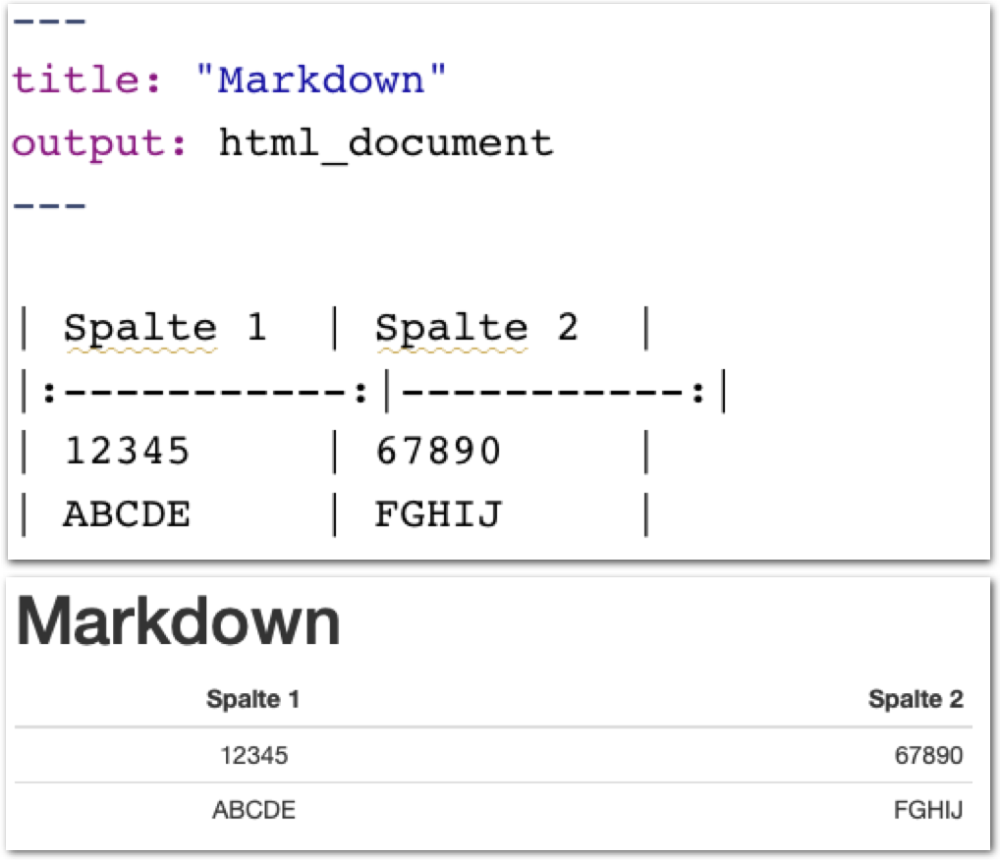
</p>

]

---

.pull-left4[

# Markdown Tabellen

<ul>
 <li class="m1"><span>Um <high>einfache Tabellen</high> zu erstellen ist kein Zusatzpaket notwendig.</span></li> 
</ul>

<table style="cellspacing:0; cellpadding:0; border:none; padding-top:10px" width=100%>
  <col width="40%">
  <col width="60%">
<tr>
  <td bgcolor="white">
    <b>Markdown</b>
  </td>
  <td bgcolor="white">
    <b>Beschreibung</b>
  </td> 
</tr>
<tr>
  <td bgcolor="white">
  <mono>|</mono>
  </td>
  <td bgcolor="white">
  Definition von <high>Spaltentrennung</high>
  </td> 
</tr>
<tr>
  <td bgcolor="white">
  <mono>---</mono>
  </td>
  <td bgcolor="white">
   Definition von <high>horizontalen Linien</high>.    
  </td> 
</tr>
<tr>
  <td bgcolor="white">
  <mono>|:,  |: :|, :|</mono> 
  </td>
  <td bgcolor="white">
  links-bündig, zentriert, rechts-bündig
  </td> 
</tr>
<tr>
  <td bgcolor="white">
  <mono></mono>
  </td>
  <td bgcolor="white">
  </td> 
</tr>
</table>

]

.pull-right5[
<br><br>
<p align = "center">
  
</p>

]

---

.pull-left4[

# YAML

<ul>
  <li class="m1"><span><b>Y</b>AML <b>A</b>'int <b>M</b>arkup <b>L</b>anguage.<span></li>
  <li class="m2"><span>Erlaubt die Definition der <high>Eigenschaften des Dokuments</high> einschliesslich Inklusionen.<span></li>
</ul>

<table style="cellspacing:0; cellpadding:0; border:none; padding-top:10px" width=100%>
  <col width="40%">
  <col width="60%">
<tr>
  <td bgcolor="white">
    <b>Argument</b>   
  </td>
  <td bgcolor="white">
    <b>Beschreibung</b>
  </td> 
</tr>
<tr>
  <td bgcolor="white">
  <mono>toc</mono> 
  </td>
  <td bgcolor="white">
  <b>T</b>able <b>O</b>f <b>C</b>ontents.
  </td> 
</tr>
<tr>
  <td bgcolor="white">
  <mono>toc_depth</mono> 
  </td>
  <td bgcolor="white">
  <high>Tiefe</high> des <b>T</b>able <b>O</b>f <b>C</b>ontents.
  </td> 
</tr>
<tr>
  <td bgcolor="white">
  <mono>theme</mono> 
  </td>
  <td bgcolor="white">
  <high>Eigenschaften</high> des Textbilds.
  </td> 
</tr>
<tr>
  <td bgcolor="white">
  <mono>includes</mono> 
  </td>
  <td bgcolor="white">
  <high>Ergänzungen</high> vor (<mono>before_body</mono>), nach (<mono>after_body</mono>) <mono>body</mono>, oder <mono>in_header</mono>.
  </td> 
</tr>
</table>

]

.pull-right5[

<br>
<p align = "center">
  
</p>

]


---

.pull-left4[

# YAML

<ul>
  <li class="m1"><span><b>Y</b>AML <b>A</b>'int <b>M</b>arkup <b>L</b>anguage.<span></li>
  <li class="m2"><span>Erlaubt die Definition der <high>Eigenschaften des Dokuments</high> einschliesslich Inklusionen.<span></li>
</ul>

<table style="cellspacing:0; cellpadding:0; border:none; padding-top:10px" width=100%>
  <col width="40%">
  <col width="60%">
<tr>
  <td bgcolor="white">
    <b>Argument</b>   
  </td>
  <td bgcolor="white">
    <b>Beschreibung</b>
  </td> 
</tr>
<tr>
  <td bgcolor="white">
  <mono>toc</mono> 
  </td>
  <td bgcolor="white">
  <b>T</b>able <b>O</b>f <b>C</b>ontents.
  </td> 
</tr>
<tr>
  <td bgcolor="white">
  <mono>toc_depth</mono> 
  </td>
  <td bgcolor="white">
  <high>Tiefe</high> des <b>T</b>able <b>O</b>f <b>C</b>ontents.
  </td> 
</tr>
<tr>
  <td bgcolor="white">
  <mono>theme</mono> 
  </td>
  <td bgcolor="white">
  <high>Eigenschaften</high> des Textbilds.
  </td> 
</tr>
<tr>
  <td bgcolor="white">
  <mono>includes</mono> 
  </td>
  <td bgcolor="white">
  <high>Ergänzungen</high> vor (<mono>before_body</mono>), nach (<mono>after_body</mono>) <mono>body</mono>, oder <mono>in_header</mono>.
  </td> 
</tr>
</table>

]

.pull-right5[

<br>
<p align = "center">
  
</p>

]

---

.pull-left4[

# YAML

<ul>
  <li class="m1"><span><b>Y</b>AML <b>A</b>'int <b>M</b>arkup <b>L</b>anguage.<span></li>
  <li class="m2"><span>Erlaubt die Definition der <high>Eigenschaften des Dokuments</high> einschliesslich Inklusionen.<span></li>
</ul>

<table style="cellspacing:0; cellpadding:0; border:none; padding-top:10px" width=100%>
  <col width="40%">
  <col width="60%">
<tr>
  <td bgcolor="white">
    <b>Argument</b>   
  </td>
  <td bgcolor="white">
    <b>Beschreibung</b>
  </td> 
</tr>
<tr>
  <td bgcolor="white">
  <mono>toc</mono> 
  </td>
  <td bgcolor="white">
  <b>T</b>able <b>O</b>f <b>C</b>ontents.
  </td> 
</tr>
<tr>
  <td bgcolor="white">
  <mono>toc_depth</mono> 
  </td>
  <td bgcolor="white">
  <high>Tiefe</high> des <b>T</b>able <b>O</b>f <b>C</b>ontents.
  </td> 
</tr>
<tr>
  <td bgcolor="white">
  <mono>theme</mono> 
  </td>
  <td bgcolor="white">
  <high>Eigenschaften</high> des Textbilds.
  </td> 
</tr>
<tr>
  <td bgcolor="white">
  <mono>includes</mono> 
  </td>
  <td bgcolor="white">
  <high>Ergänzungen</high> vor (<mono>before_body</mono>), nach (<mono>after_body</mono>) <mono>body</mono>, oder <mono>in_header</mono>.
  </td> 
</tr>
</table>

]

.pull-right5[

<br>
<p align = "center">
  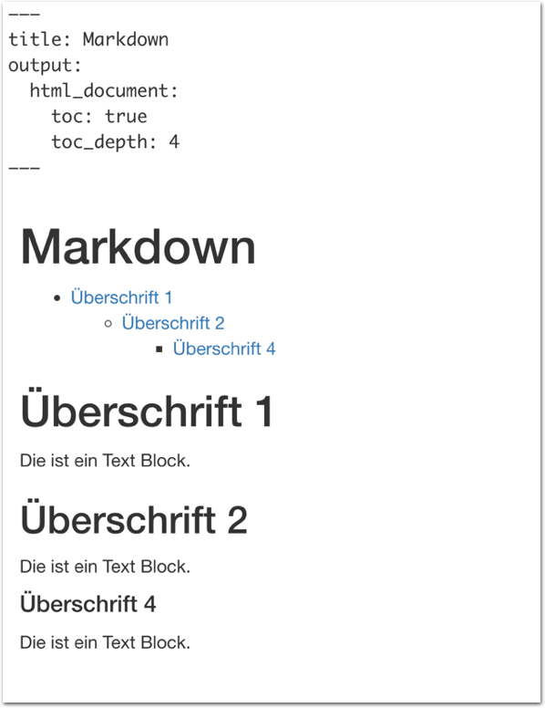
</p>

]

---

.pull-left4[

# YAML

<ul>
  <li class="m1"><span><b>Y</b>AML <b>A</b>'int <b>M</b>arkup <b>L</b>anguage.<span></li>
  <li class="m2"><span>Erlaubt die Definition der <high>Eigenschaften des Dokuments</high> einschliesslich Inklusionen.<span></li>
</ul>

<table style="cellspacing:0; cellpadding:0; border:none; padding-top:10px" width=100%>
  <col width="40%">
  <col width="60%">
<tr>
  <td bgcolor="white">
    <b>Argument</b>   
  </td>
  <td bgcolor="white">
    <b>Beschreibung</b>
  </td> 
</tr>
<tr>
  <td bgcolor="white">
  <mono>toc</mono> 
  </td>
  <td bgcolor="white">
  <b>T</b>able <b>O</b>f <b>C</b>ontents.
  </td> 
</tr>
<tr>
  <td bgcolor="white">
  <mono>toc_depth</mono> 
  </td>
  <td bgcolor="white">
  <high>Tiefe</high> des <b>T</b>able <b>O</b>f <b>C</b>ontents.
  </td> 
</tr>
<tr>
  <td bgcolor="white">
  <mono>theme</mono> 
  </td>
  <td bgcolor="white">
  <high>Eigenschaften</high> des Textbilds.
  </td> 
</tr>
<tr>
  <td bgcolor="white">
  <mono>includes</mono> 
  </td>
  <td bgcolor="white">
  <high>Ergänzungen</high> vor (<mono>before_body</mono>), nach (<mono>after_body</mono>) <mono>body</mono>, oder <mono>in_header</mono>.
  </td> 
</tr>
</table>

]

.pull-right5[

<br>
<p align = "center">
  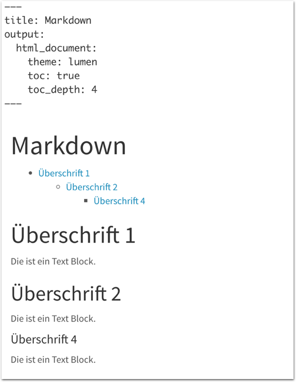
</p>

]

---

.pull-left4[

# YAML

<ul>
  <li class="m1"><span><b>Y</b>AML <b>A</b>'int <b>M</b>arkup <b>L</b>anguage.<span></li>
  <li class="m2"><span>Erlaubt die Definition der <high>Eigenschaften des Dokuments</high> einschliesslich Inklusionen.<span></li>
</ul>

<table style="cellspacing:0; cellpadding:0; border:none; padding-top:10px" width=100%>
  <col width="40%">
  <col width="60%">
<tr>
  <td bgcolor="white">
    <b>Argument</b>   
  </td>
  <td bgcolor="white">
    <b>Beschreibung</b>
  </td> 
</tr>
<tr>
  <td bgcolor="white">
  <mono>toc</mono> 
  </td>
  <td bgcolor="white">
  <b>T</b>able <b>O</b>f <b>C</b>ontents.
  </td> 
</tr>
<tr>
  <td bgcolor="white">
  <mono>toc_depth</mono> 
  </td>
  <td bgcolor="white">
  <high>Tiefe</high> des <b>T</b>able <b>O</b>f <b>C</b>ontents.
  </td> 
</tr>
<tr>
  <td bgcolor="white">
  <mono>theme</mono> 
  </td>
  <td bgcolor="white">
  <high>Eigenschaften</high> des Textbilds.
  </td> 
</tr>
<tr>
  <td bgcolor="white">
  <mono>includes</mono> 
  </td>
  <td bgcolor="white">
  <high>Ergänzungen</high> vor (<mono>before_body</mono>), nach (<mono>after_body</mono>) <mono>body</mono>, oder <mono>in_header</mono>.
  </td> 
</tr>
</table>

]

.pull-right5[

<br>
<p align = "center">
  
</p>

]

---

.pull-left4[

# YAML

<ul>
  <li class="m1"><span><b>Y</b>AML <b>A</b>'int <b>M</b>arkup <b>L</b>anguage.<span></li>
  <li class="m2"><span>Erlaubt die Definition der <high>Eigenschaften des Dokuments</high> einschliesslich Inklusionen.<span></li>
</ul>

<table style="cellspacing:0; cellpadding:0; border:none; padding-top:10px" width=100%>
  <col width="40%">
  <col width="60%">
<tr>
  <td bgcolor="white">
    <b>Argument</b>   
  </td>
  <td bgcolor="white">
    <b>Beschreibung</b>
  </td> 
</tr>
<tr>
  <td bgcolor="white">
  <mono>toc</mono> 
  </td>
  <td bgcolor="white">
  <b>T</b>able <b>O</b>f <b>C</b>ontents.
  </td> 
</tr>
<tr>
  <td bgcolor="white">
  <mono>toc_depth</mono> 
  </td>
  <td bgcolor="white">
  <high>Tiefe</high> des <b>T</b>able <b>O</b>f <b>C</b>ontents.
  </td> 
</tr>
<tr>
  <td bgcolor="white">
  <mono>theme</mono> 
  </td>
  <td bgcolor="white">
  <high>Eigenschaften</high> des Textbilds.
  </td> 
</tr>
<tr>
  <td bgcolor="white">
  <mono>includes</mono> 
  </td>
  <td bgcolor="white">
  <high>Ergänzungen</high> vor (<mono>before_body</mono>), nach (<mono>after_body</mono>) <mono>body</mono>, oder <mono>in_header</mono>.
  </td> 
</tr>
</table>

]

.pull-right5[

<br>
<p align = "center">
  
</p>

]

---

.pull-left3[

# HTML


<ul>
  <li class="m1"><span><b>H</b>ypertext <b>M</b>arkup <b>L</b>anguage ermöglicht die Organization von Text und Inhalten mittels <high>HTML-Tags<high>.</span></li> 
  </ul>

<table style="cellspacing:0; cellpadding:0; border:none; padding-top:10px" width=100%>
  <col width="40%">
  <col width="60%">
<tr>
  <td bgcolor="white">
    <b>Tag</b>   
  </td>
  <td bgcolor="white">
    <b>Beschreibung</b>
  </td> 
</tr>
<tr>
  <td bgcolor="white">
  <mono>&lt;h1&gt;, &lt;h2&gt,...</mono> </td>
  <td bgcolor="white">
  <high>Überschrift</high> Level 1, 2,...
  </td> 
</tr>
<tr>
  <td bgcolor="white">
  <mono>&lt;br&gt;</mono>
  </td>
  <td bgcolor="white">
   Neue <high>Zeile</high>.
  </td> 
</tr>
<tr>
  <td bgcolor="white">
  <mono>&lt;b&gt;, &lt;i&gt;, &lt;u&gt;</mono>
  </td>
  <td bgcolor="white">
  <high>Fett, Kursiv, Unterstrichen.</high>
  </td> 
</tr>
<tr>
  <td bgcolor="white">
  <mono>&lt;div&gt;, &lt;p&gt;</mono> 
  </td>
  <td bgcolor="white">
  <high>Abschnitt, Textabschnitt.</high>
  </td> 
</tr>
<tr>
  <td bgcolor="white">
  <mono>&lt;table&gt;</mono> 
  </td>
  <td bgcolor="white">
  <high>Tabelle, Spalten.</high>
  </td> 
</tr>
</table>

]

.pull-right6[

<br>
<p align = "center">
  
</p>

]

---

.pull-left3[

# HTML


<ul>
  <li class="m1"><span><b>H</b>ypertext <b>M</b>arkup <b>L</b>anguage ermöglicht die Organization von Text und Inhalten mittels <high>HTML-Tags<high>.</span></li> 
  </ul>

<table style="cellspacing:0; cellpadding:0; border:none; padding-top:10px" width=100%>
  <col width="40%">
  <col width="60%">
<tr>
  <td bgcolor="white">
    <b>Tag</b>   
  </td>
  <td bgcolor="white">
    <b>Beschreibung</b>
  </td> 
</tr>
<tr>
  <td bgcolor="white">
  <mono>&lt;h1&gt;, &lt;h2&gt,...</mono> </td>
  <td bgcolor="white">
  <high>Überschrift</high> Level 1, 2,...
  </td> 
</tr>
<tr>
  <td bgcolor="white">
  <mono>&lt;br&gt;</mono>
  </td>
  <td bgcolor="white">
   Neue <high>Zeile</high>.
  </td> 
</tr>
<tr>
  <td bgcolor="white">
  <mono>&lt;b&gt;, &lt;i&gt;, &lt;u&gt;</mono>
  </td>
  <td bgcolor="white">
  <high>Fett, Kursiv, Unterstrichen.</high>
  </td> 
</tr>
<tr>
  <td bgcolor="white">
  <mono>&lt;div&gt;, &lt;p&gt;</mono> 
  </td>
  <td bgcolor="white">
  <high>Abschnitt, Textabschnitt.</high>
  </td> 
</tr>
<tr>
  <td bgcolor="white">
  <mono>&lt;table&gt;</mono> 
  </td>
  <td bgcolor="white">
  <high>Tabelle, Spalten.</high>
  </td> 
</tr>
</table>

]

.pull-right6[

<br><br><br>
<p align = "center">
  
</p>

]


---

.pull-left3[

# HTML


<ul>
  <li class="m1"><span><b>H</b>ypertext <b>M</b>arkup <b>L</b>anguage ermöglicht die Organization von Text und Inhalten mittels <high>HTML-Tags<high>.</span></li> 
  </ul>

<table style="cellspacing:0; cellpadding:0; border:none; padding-top:10px" width=100%>
  <col width="40%">
  <col width="60%">
<tr>
  <td bgcolor="white">
    <b>Tag</b>   
  </td>
  <td bgcolor="white">
    <b>Beschreibung</b>
  </td> 
</tr>
<tr>
  <td bgcolor="white">
  <mono>&lt;h1&gt;, &lt;h2&gt,...</mono> </td>
  <td bgcolor="white">
  <high>Überschrift</high> Level 1, 2,...
  </td> 
</tr>
<tr>
  <td bgcolor="white">
  <mono>&lt;br&gt;</mono>
  </td>
  <td bgcolor="white">
   Neue <high>Zeile</high>.
  </td> 
</tr>
<tr>
  <td bgcolor="white">
  <mono>&lt;b&gt;, &lt;i&gt;, &lt;u&gt;</mono>
  </td>
  <td bgcolor="white">
  <high>Fett, Kursiv, Unterstrichen.</high>
  </td> 
</tr>
<tr>
  <td bgcolor="white">
  <mono>&lt;div&gt;, &lt;p&gt;</mono> 
  </td>
  <td bgcolor="white">
  <high>Abschnitt, Textabschnitt.</high>
  </td> 
</tr>
<tr>
  <td bgcolor="white">
  <mono>&lt;table&gt;</mono> 
  </td>
  <td bgcolor="white">
  <high>Tabelle, Spalten.</high>
  </td> 
</tr>
</table>

]

.pull-right6[

<br><br>
<p align = "center">
  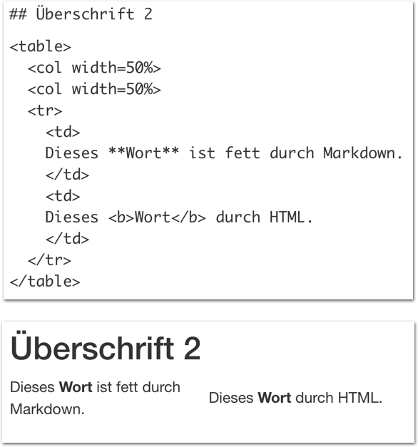
</p>

]


---

.pull-left3[

# HTML


<ul>
  <li class="m1"><span><b>H</b>ypertext <b>M</b>arkup <b>L</b>anguage ermöglicht die Organization von Text und Inhalten mittels <high>HTML-Tags<high>.</span></li> 
  </ul>

<table style="cellspacing:0; cellpadding:0; border:none; padding-top:10px" width=100%>
  <col width="40%">
  <col width="60%">
<tr>
  <td bgcolor="white">
    <b>Tag</b>   
  </td>
  <td bgcolor="white">
    <b>Beschreibung</b>
  </td> 
</tr>
<tr>
  <td bgcolor="white">
  <mono>&lt;h1&gt;, &lt;h2&gt,...</mono> </td>
  <td bgcolor="white">
  <high>Überschrift</high> Level 1, 2,...
  </td> 
</tr>
<tr>
  <td bgcolor="white">
  <mono>&lt;br&gt;</mono>
  </td>
  <td bgcolor="white">
   Neue <high>Zeile</high>.
  </td> 
</tr>
<tr>
  <td bgcolor="white">
  <mono>&lt;b&gt;, &lt;i&gt;, &lt;u&gt;</mono>
  </td>
  <td bgcolor="white">
  <high>Fett, Kursiv, Unterstrichen.</high>
  </td> 
</tr>
<tr>
  <td bgcolor="white">
  <mono>&lt;div&gt;, &lt;p&gt;</mono> 
  </td>
  <td bgcolor="white">
  <high>Abschnitt, Textabschnitt.</high>
  </td> 
</tr>
<tr>
  <td bgcolor="white">
  <mono>&lt;table&gt;</mono> 
  </td>
  <td bgcolor="white">
  <high>Tabelle, Spalten.</high>
  </td> 
</tr>
</table>

]

.pull-right6[

<br><br>
<p align = "center">
  
</p>

]

---

.pull-left3[

# HTML


<ul>
  <li class="m1"><span><b>H</b>ypertext <b>M</b>arkup <b>L</b>anguage ermöglicht die Organization von Text und Inhalten mittels <high>HTML-Tags<high>.</span></li> 
  </ul>

<table style="cellspacing:0; cellpadding:0; border:none; padding-top:10px" width=100%>
  <col width="40%">
  <col width="60%">
<tr>
  <td bgcolor="white">
    <b>Tag</b>   
  </td>
  <td bgcolor="white">
    <b>Beschreibung</b>
  </td> 
</tr>
<tr>
  <td bgcolor="white">
  <mono>&lt;h1&gt;, &lt;h2&gt,...</mono> </td>
  <td bgcolor="white">
  <high>Überschrift</high> Level 1, 2,...
  </td> 
</tr>
<tr>
  <td bgcolor="white">
  <mono>&lt;br&gt;</mono>
  </td>
  <td bgcolor="white">
   Neue <high>Zeile</high>.
  </td> 
</tr>
<tr>
  <td bgcolor="white">
  <mono>&lt;b&gt;, &lt;i&gt;, &lt;u&gt;</mono>
  </td>
  <td bgcolor="white">
  <high>Fett, Kursiv, Unterstrichen.</high>
  </td> 
</tr>
<tr>
  <td bgcolor="white">
  <mono>&lt;div&gt;, &lt;p&gt;</mono> 
  </td>
  <td bgcolor="white">
  <high>Abschnitt, Textabschnitt.</high>
  </td> 
</tr>
<tr>
  <td bgcolor="white">
  <mono>&lt;table&gt;</mono> 
  </td>
  <td bgcolor="white">
  <high>Tabelle, Spalten.</high>
  </td> 
</tr>
</table>

]

.pull-right6[

<br><br>
<p align = "center">
  
</p>

]

---

.pull-left3[

# CSS

<ul>
  <li class="m1"><span>Mit <b>C</b>ascading <b>S</b>tyle <b>S</b>sheets können alle <high>ästhetischen Charakteristika</high> von <high>HTML</high> Dokumenten über eine externe Datei bestimmt werden.</span></li>
  <li class="m2"><span>CSS erlaubt komplexe <high>Vererbungen des Stils</high> zwischen HTML Tags.</span></li> 
</ul>

]

.pull-right6[

<br><br>
<p align = "center">
  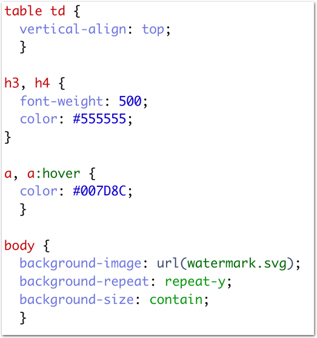
</p>

]

---


# Grafiken

.pull-left3[

<ul>
  <li class="m1"><span>Die Gestaltung des Berichts beinhaltet auch die <high>Gestaltung der Abbildungen</high>.</span></li> 
  <li class="m2"><span>Im <mono>ggplot2</mono> Pakets lässt sich die Gestaltung von Grafiken durch <mono>theme</mono>s bestimmen.</span></li>
  <li class="m2"><span>Mit etwas Kreativität lassen sich ebenfalls die <high>Default-Farben</high> bestimmen.</span></li> 
</ul>

]

.pull-right65[

```{r include =F}
# Lade Pakete
library(tidyverse)
library(knitr)
library(sjPlot)
library(kableExtra)
library(lubridate)

# Lade Daten
airbnb_1819 <- read_csv('1_Data/airbnb.csv') %>% 
  filter(Erstellungsdatum > "2018-01-01", 
         Erstellungsdatum < "2019-12-31")
```


```{r eval = TRUE, echo  =TRUE, message = F, warning = F}

# Ändere Thema zu minimal
theme_set(theme_minimal())
theme_update(panel.background = 
             element_rect(fill = "transparent",
                          colour = NA),
             plot.background = 
             element_rect(fill = "transparent",
                          colour = NA))

# Setze defaults in ggplot
ggplot <- function(...) {
 ggplot2::ggplot(...) + 
  scale_fill_gradientn(colors = c('#555555', '#6BB7B9')) + 
  scale_colour_gradientn(colors = c('#555555', '#6BB7B9'))
  }

```


</p>

]

---


# Grafiken

.pull-left3[

<ul>
  <li class="m1"><span>Die Gestaltung des Berichts beinhaltet auch die <high>Gestaltung der Abbildungen</high>.</span></li> 
  <li class="m2"><span>Im <mono>ggplot2</mono> Pakets lässt sich die Gestaltung von Grafiken durch <mono>theme</mono>s bestimmen.</span></li>
  <li class="m2"><span>Mit etwas Kreativität lassen sich ebenfalls die <high>Default-Farben</high> bestimmen.</span></li> 
</ul>

]

.pull-right6[


```{r eval = TRUE, echo  =FALSE, message = F, warning = F}

airbnb_plot <- ggplot(airbnb_1819 %>% 
         group_by(Jahr = year(Erstellungsdatum), month = month(Erstellungsdatum)) %>% 
         summarize(
           Monat = forcats::as_factor(paste(first(Jahr), first(month), sep = '-')),
           Wohnungen = n()), 
       aes(x = Monat, y = Wohnungen,fill = Jahr)) + 
  geom_bar(stat='identity', position='dodge') + 
  theme(legend.position = 'none',
        axis.text.x = element_text(angle = 45, hjust = 1))
```

```{r,echo=T, fig.width=4, fig.height=4, fig.asp = .65}
airbnb_plot
```

]

---

.pull-left4[


# Ziel

<ul>
  <li class="m1"><span>Erstellt einen <high>Airbnb-Bericht</high> für Berlin für die Jahre 2018 und 2019.</span></li>
  <li class="m2"><span>Evaluiert</span></li>
  <ul>
    <li><span>Wohnungs-<high>Neueinstellungen</high> über die Zeit und Stadtteile.</span></li>
    <li><span>Entwicklung der <high>Preise</high>.</span></li>
    <li><span>Einfluss von <high>Ausstattungsmerkmalen</high> auf den Preis.</span></li>
  </ul>
</ul>

]

.pull-right5[

<p align = "center">
  
</p>

]

---

class: middle, center

<h1><a href="https://cdsbasel.github.io/dataanalytics_2021/menu/materials.html">Practical</a></h1>

