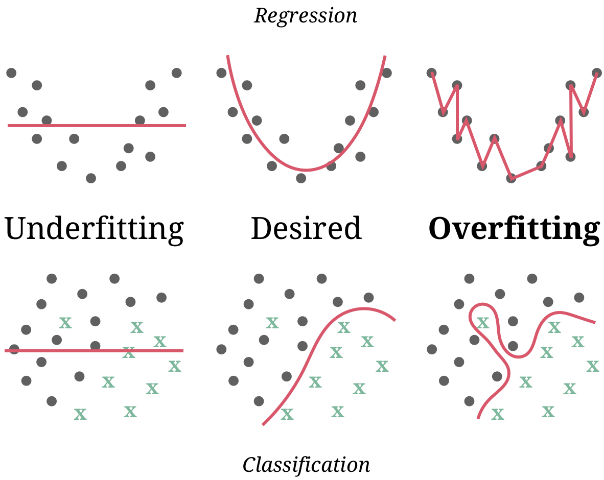

layout: true

<div class="my-footer">
  <span style="text-align:center">
    <span> 
      
    </span>
    <a href="https://cdsbasel.github.io/dataanalytics_2021">
      <span style="padding-left:82px"> 
        <font color="#7E7E7E">
          https://cdsbasel.github.io/dataanalytics_2021
        </font>
      </span>
    </a>
    <a href="https://therbootcamp.github.io/">
      <font color="#7E7E7E">
       Data analytics for Psychology and Business | April 2021
      </font>
    </a>
    </span>
  </div> 

---


```{r setup, include=FALSE}
library(tidyverse)
options(htmltools.dir.version = FALSE)
# see: https://github.com/yihui/xaringan
# install.packages("xaringan")
# see: 
# https://github.com/yihui/xaringan/wiki
# https://github.com/gnab/remark/wiki/Markdown
options(width=110)
options(digits = 4)

source("https://raw.githubusercontent.com/therbootcamp/ML_2019Oct/master/_materials/code/baselrbootcamp_palettes.R")


basel <- read_csv("1_Data/baselers.csv")
```

```{r, echo = FALSE ,message = FALSE, warning = FALSE}
knitr::opts_chunk$set(comment=NA, fig.width=6, fig.height=6, echo = TRUE, eval = TRUE, 
                      message = FALSE, warning = FALSE, fig.align = 'center', dpi = 200)
library(tidyverse)
library(caret)
library(ggthemes)
library(knitr)

set.seed(100)

past <- tibble(id = 1:5,
               sex = sample(c("m", "f"), size  = 5, replace = TRUE),
               age = round(rnorm(5, mean = 45, sd = 5), 0),
               fam_history = sample(c("Yes", "No"), size = 5, replace = TRUE),
               smoking = sample(c(TRUE, FALSE), size = 5, replace = TRUE),
               criterion = sample(c(0, 1), size = 5, replace = TRUE))

present <- tibble(id = 91:95,
                  sex = sample(c("m", "f"), size  = 5, replace = TRUE),
               age = round(rnorm(5, mean = 45, sd = 5), 0),
               fam_history = sample(c("Yes", "No"), size = 5, replace = TRUE),
               smoking = sample(c(TRUE, FALSE), size = 5, replace = TRUE),
               criterion = rep("?", 5))
```


# Prediction is...

.pull-left45[

<p>
<font style="font-size:32px"><i>Prediction is very difficult, especially if it's about the future.</i></font>
<br><br>
Nils Bohr, Nobel Laureate in Physics
<br><br>
<font style="font-size:32px"><i>An economist is an expert who will know tomorrow why the things he predicted yesterday didn't happen today.</i></font>
<br><br>

Evan Esar, Humorist

</p>

]

.pull-right45[

<p align = "center">
<br>
<font style="font-size:10px">from <a href="https://futurism.com/know-your-scientist-niels-bohr-the-father-of-the-atom">futurism.com</a></font>
</p>

]

---

# Hold-out data

.pull-left45[

<ul>
  <li class="m1"><span>Model performance must be evaluated as true prediction on an <high>unseen data set</high>.</span></li><br>
  <li class="m2"><span>The unseen data set can be <high>naturally</high> occurring.</span></li>
  <ul class="level">
    <li><span>e.g. using 2019 stock prizes to evaluate a model fit using 2018 stock prizes</span></li>
  </ul><br>
  <li class="m3"><span>More commonly unseen data is created by <high>splitting the available data</high> into a training set and a test set..</span></li>
</ul>

]


.pull-right45[

<p align = "center">

</p>

]

---

# Training

<p align = "center" style="padding-top:30px;padding-left:40px">

</p>


---

# Test

<p align = "center" style="padding-top:30px;padding-left:40px">

</p>


---

.pull-left4[

<br><br>
# Overfitting

<ul>
  <li class="m1"><span>Occurs when a model <high>fits data too closely</high> and therefore fails to reliably predict future observations.</span></li><br>
  <li class="m2"><span>Overfitting occurs when a model 'mistakes' random <high>noise</high> for a predictable <high>signal</high>.</span></li><br>
  <li class="m3"><span>More <high>complex models</high> are more prone to overfitting.</span></li>
</ul>

]


.pull-right5[
<br><br><br>
<p align = "center" style="padding-top:0px">

</p>

]


---

# Overfitting

```{r, fig.width = 8, fig.height = 3.5, echo = FALSE, eval = TRUE, warning = FALSE, dpi = 200}
set.seed(5)

N <- 40

iv <- rnorm(N, mean = 10, sd = 2)
truth <- iv 
noise <- rnorm(N, mean = 0, sd = 2)
obs <- truth + noise

data <- data.frame(iv, obs)


poly_pred <- map_dfc(.x = c(1, 19), .f = function(degree) {
  
  output <- data.frame(lm(obs ~ poly(iv, degree), data = data)$fitted.values)
  
  names(output) <- paste0("d", degree)
  
  return(output)

}) %>% mutate(id = 1:N,
              x = iv,
              obs = obs) %>%
  gather(Degree, pred, -id, -x, -obs) %>%
  mutate(`Training` = abs(pred - obs))


poly_pred <- poly_pred %>%
  mutate(Model = case_when(Degree == "d1" ~ "Simple model",
                            TRUE ~ "Complex model"))


overfit_gg <- ggplot(poly_pred, aes(x = x, y = pred, col = Model)) + 
  geom_line(size = 1.2) +
  geom_point(aes(x = x, y = obs), col = "black", pch = 21) +
  annotate("segment", x = 5, y = 5, xend = 15, yend = 15, col = "black", linetype = 4, size = 1) +
  xlim(5, 15) +
  ylim(5, 15) +
  labs(title = "Three models",
       subtitle = "Dashed line is TRUE model",
       x = "Feature",
       y = "Criterion") +
  theme_bw() +
    theme(legend.position="bottom") +
  scale_color_baselrbootcamp()
  
poly_pred <- poly_pred %>% mutate(

  obs_new = x + rnorm(1, mean = 0, sd = 2),
  `Testing` = abs(obs_new - pred)
  
)


poly_pred <- poly_pred %>%
  select(Model, `Training`, `Testing`) %>%
  gather(phase, Error, -Model)

agg <- poly_pred %>%
  group_by(Model, phase) %>%
  summarise(Error = mean(Error)) %>%
  ungroup() %>%
  mutate(phase = factor(phase, levels = c("Training", "Testing"), ordered = TRUE))
 
fit_gg <- ggplot(agg, aes(x = phase, y = Error, fill = Model)) +
  geom_bar(position = "dodge", stat = "identity") +
  labs(title = "Fitting versus prediction error",
       subtitle = "Smaller values are better!",
       x = "Modelling phase") +  
  scale_y_continuous(limits=c(.75,1.25),oob = scales::rescale_none) +
  theme_bw() +
    theme(legend.position="bottom") +
  scale_fill_baselrbootcamp()

ggpubr::ggarrange(overfit_gg, fit_gg)
```


---

class: center,  middle

<h1><a>Evaluating model predictions with <mono>caret</mono></h1>


```{r, echo = FALSE}
library(caret)
data(cars)
```


<!---

# <mono>createDataPartition()</mono>

.pull-left4[

Use `createDataPartition()` to <high>split a dataset</high> into separate training and test datasets.

<table style="cellspacing:0; cellpadding:0; border:none;">
  <col width="30%">
  <col width="70%">
<tr>
  <td bgcolor="white">
    <b>Argument</b>
  </td>
  <td bgcolor="white">
    <b>Description</b>
  </td>  
</tr>
<tr>
  <td bgcolor="white">
    <mono>y</mono>
  </td>
  <td bgcolor="white">
    The criterion. Used to create a <high>balanced split</high>.  
  </td>  
</tr>
<tr>
  <td bgcolor="white">
    <mono>p</mono>
  </td>
  <td bgcolor="white">
    The <high>proportion of data</high> going into the training set. Often <mono>.8</mono> or <mono>.5</mono>.    
  </td>  
</tr>
</table>


]

.pull-right5[

```{r, eval = FALSE, echo = TRUE}
# Set the randomisation seed to get the 
#  same results each time
set.seed(100)

# Get indices for training
index <- 
  createDataPartition(y = basel$income,
                             p = .8,
                             list = FALSE)

# Create training data
basel_train <- basel %>% 
  slice(index)

# Create test data
basel_test <- basel %>% 
  slice(-index)
```


]


--->

---

# <mono>predict(, newdata)</mono>

.pull-left4[

<ul>
  <li class="m1"><span>To <high>test model predictions</high>, you nee to compute a vector of predictions from a the test data (<mono>newdata</mono> using the <mono>predict()</mono> function:</span></li>
</ul>


<table style="cellspacing:0; cellpadding:0; border:none;">
  <col width="30%">
  <col width="70%">
<tr>
  <td bgcolor="white">
    <b>Argument</b>
  </td>
  <td bgcolor="white">
    <b>Description</b>
  </td>  
</tr>
<tr>
  <td bgcolor="white">
    <mono>object</mono>
  </td>
  <td bgcolor="white">
    <mono>caret</mono> fit object.  
  </td>  
</tr>
<tr>
  <td bgcolor="white">
    <mono>newdata</mono>
  </td>
  <td bgcolor="white">
    Test data sest. Must contain same features as provided in <mono>object</mono>.    
  </td>  
</tr>
</table>

]

.pull-right5[

```{r, eval = FALSE}
# Fit model to training data
mod <- train(form = income ~ .,
             method = "glm",
             data = basel_train)

# Get fitted values (for training data)
mod_fit <- predict(mod)

# Predictions for NEW data_test data!
mod_pred <- predict(mod, 
                    newdata = basel_test)

# Evaluate prediction results
postResample(pred = mod_pred, 
             obs = basel_test$income)
```

]


---
class: middle, center

<h1><a href=https://therbootcamp.github.io/ML-DHLab/_sessions/Prediction/Prediction_practical.html>Practical</a></h1>


